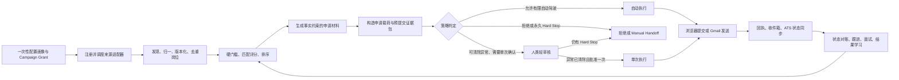

# CareerOps 高自治求职全链路 Spec

- 文档状态：Proposed
- 版本：1.0.2
- 日期：2026-07-22
- 目标版本：CareerOps Full Workflow v1（未来目标态，当前仓库尚未发布）
- 产品形态：单用户、自托管、中文优先的高自治求职操作系统
- 实施效力：未来目标合同；仅经对应 Phase Exit、ADR 变更与 Release Qualification 后逐项生效
- 规范关键词：`必须`、`禁止`、`应`、`可以`分别对应 MUST、MUST NOT、SHOULD、MAY

## 1. 文档目的与优先级

本 Spec 冻结 CareerOps 从岗位发现到投递、邮件回流、状态对账的完整产品和技术合同。
它解决四个此前容易混淆的问题：

1. 岗位来源不是固定“渠道”，而是注册、版本化、可配置的抓取适配器。
2. “生成材料”不等于“已经投递”。
3. “邮箱工作流”必须包含真实账户配置、收件、发件、回执和对账，不能只存在草稿。
4. Agent 可以承担绝大多数工作，但外部副作用必须受 Campaign Grant、策略、回执和
   Kill Switch 约束。

发生冲突时，优先级如下：

1. 已接受的安全与架构 ADR；
2. 本 Spec；
3. `DESIGN.md`；
4. 里程碑计划、验收文档和 runbook；
5. README 与示例配置。

本 Spec 不自动启用任何尚未发布的能力。扩大权限必须同时更新相关 ADR、威胁模型、验收
证据和 Release Qualification。

### 1.1 时间层级与规范效力

本文档必须按三个时间层级阅读：

1. `Current Baseline`：第 4 节记录当前仓库真实状态，是对“现在能否使用”的唯一答案。
2. `Future Target`：其余“必须”定义 Full Workflow 最终形态，不表示当前已实现。
3. `Activation Gate`：任一目标能力只有在对应 Phase Exit、适用 ADR、迁移、测试和
   Release Qualification 同时通过后才能开启。

当前 ADR 0001 排除自动申请，ADR 0004 将 Gmail 只读同步与发件分期，ADR 0011 定义了
campaign-scoped bounded-autopilot 授权框架，ADR 0012 定义了专用 BYO Gmail 的只读同步边界，
ADR 0013 定义了 Gmail send 只能作为独立 reviewed outbox side-effect channel。当前仓库已有
synthetic reservation、G011 Gmail 只读 client/worker/control-plane，以及 G012/G015 reviewed
Gmail send 控制面、outbox、receipt/ambiguity/reconciliation 和 worker/CLI 脚手架；G014 已将受审
爬虫证据、canonical job ingestion、确定性匹配、exact Gmail draft、中文轻审核、outbox enqueue
和 receipt/reconciliation inspection 绑定到 GoalRun。2026-07-21 的本机部署已增加 Desktop
loopback + PKCE OAuth、原生 macOS Keychain、同 UID Unix-socket broker 和 onboarding 控制面，
并已完成一个真实 `gmail.readonly` 授权；该授权尚未注册进业务控制面，也未跑 mailbox sync。
真实 `gmail.send` 授权、资格化 smoke、Sent/readonly 对账和账号注册仍未完成。因此本 Spec 中
真实 Gmail send、真实 Browser submit 和 limited-autopilot 均是未来门禁结果；未通过门禁前，
现有默认禁用、Gmail 只读同步不可用、Gmail send provider I/O 不可用和
manual/synthetic 边界继续具有规范效力。本文的 `Phase 0–6` 是未来实施工作流，不替代现有
ADR 的里程碑编号。

## 2. 最终结果

CareerOps 的目标闭环为：



正常运行时，用户只需要：

- 首次确认候选人事实库、求职目标和授权范围；
- 每天浏览一次自动动作摘要；
- 处理敏感字段、站点异常、低置信度和对账失败；
- 对 offer、法律承诺、身份材料、薪资承诺和日历写入做最终决定。

Agent 应承担岗位搜索、去重、排序、公司研究、材料定制、表单字段映射、申请执行、回执
采集、邮件分类和跟进准备。

## 3. “完整链路”声明规则

产品、README、UI 和日志必须使用下表中的精确措辞：

| 声明 | 必须同时满足 |
| --- | --- |
| 岗位发现已打通 | 已启用来源实例能执行，结果进入 canonical job 模型，执行结果可审计 |
| 申请准备已打通 | 评分、材料、字段映射和 Review Packet 都有不可变版本及事实引用 |
| Gmail 只读同步已打通 | 真实专用 Gmail 已连接；只有 `gmail.readonly`；readonly RQ、增量同步、分类、关联、撤销和隐私验收通过；未开启 send |
| 邮箱链路已打通 | 真实专用 Gmail 已连接；readonly sync 与 send 的 RQ 都通过；发送有 provider receipt；超时可对账 |
| Greenhouse API 投递已打通 | 真实雇主授权的 Greenhouse Job Board API credential/broker 已 Release Qualified；固定源 POST、不可重投回执和人工证据对账 E2E 通过 |
| 浏览器投递已打通 | 某个另行 ADR 和 Release Qualification 的 hosted-form browser adapter 能够填表、提交、保存回执并安全对账；不得拿 Greenhouse API 通道冒充浏览器通道 |
| 全链路已打通 | 发现、评分、材料、真实 Gmail send、至少一个真实申请提交通道、邮箱回流、状态 reducer、审计和恢复 E2E 通过，且第 22 节全部勾选 |

以下情况禁止声称“已经投递”：

- 只生成了 CV、求职信或邮件草稿；
- 只填完表但没有点击提交；
- 点击后没有可确认回执且仍未完成对账；
- 只有用户交接包，没有 provider receipt；
- 仅在 `.test` 或合成 fixture 中成功。

## 4. 当前实现基线

本节描述 2026-07-22 仓库与当前本机部署状态，不是目标能力承诺。

| 能力 | 当前状态 | 本 Spec 目标 |
| --- | --- | --- |
| 配置化招聘爬虫 | 已实现注册适配器、manifest、request/approve/outbox/result 与 Homebrew-native crawler-outbox；当前 pending standalone request 早于任何 GoalRun 创建，只能验证独立爬取，不能作为后建 GoalRun 的 discovery 证据 | 持久化来源注册表、调度、游标和统一入库 |
| 抓取审批与结果 | 已实现服务端审核及 `succeeded/failed/reconciliation_required` | 纳入统一能力、告警和运行看板 |
| 岗位 canonical 模型 | 表结构、reviewed public-ATS ingestion 和处理脚本已有基础；public ATS row schema v2 已将 `source_job_industry` / `source_job_industries` 映射到 canonical structured `industry` / `industries`。该 v2 路径已部署到 Homebrew-native 运行副本，但尚未由 GoalRun 绑定的真实 crawler result 完成本机 E2E；其他职位描述/技能等富字段映射证据仍不完整 | 形成在线归一、版本、去重、关闭/重开闭环 |
| 匹配与申请草稿 | 已实现显式 `pre_application_only`：请求只引用 `candidate_id` + `candidate_profile_version_id`；GoalRun 创建事务内校验该版本仍是 owner 的最新 APPROVE 版本，关联 CAS 材料仍 active、未过期，再从已批准 preferences 派生 `match_config` 与 hash-bound 匹配上下文；调用方不得提供或覆盖 `match_config`。`goal_run_pre_application_artifact.v2` 将岗位分为 `eligible` / `needs_manual_review` / `ineligible`；required keywords 采用 ALL-of，公司/行业/seniority/location allowlist 均为硬门槛，缺失必要证据进入人工复核。只有 `eligibility=eligible` 且 score >= `min_score` 才能 `selectable=true`；`needs_manual_review` 审核包使用 `proposed_manual_review_job` + `review_disposition=manual_evidence_required`，不得写为 `selected_job`。候选 SQL 必须先按 `canonical_job_id` 去重并保留最新证据/版本，再应用 `LIMIT`。`0024` 的数据库插入触发器会在新 preapp GoalRun 落库前锁定候选人并重验最新 active APPROVE profile 的 ID/version 与 snapshot/bundle hashes，同时拒绝混入 Gmail envelope、缺失 `match_config` 和未知显式 mode。这些 v2 路径、`0022`–`0024` 与 `careerops-candidate-profiles` CLI 已部署；候选资料和材料已导入但仍待人工批准，因此当前 GoalRun 数为 0，尚无本机 E2E 证据 | 完整硬门槛、评分、解释、事实约束材料 |
| 手工投递交接 | 已实现，明确为 human-final-submission | 保留为所有未知站点的安全降级 |
| Autopilot Grant | 策略、数据库控制面和合成 reservation 已有基础 | 接入真实 provider，但仅允许经资格认证的低风险动作 |
| 浏览器自动投递 | 仅合成 `.test` 适配器；无真实浏览器 provider | 隔离 Browser Worker + 真实适配器 + receipt/reconcile |
| Gmail OAuth/收件 | 已实现 Desktop loopback + PKCE、原生 macOS Keychain 密钥边界、same-UID Unix-socket broker、exact `gmail.readonly` 校验、Gmail REST profile/list/get/history、checkpoint/polling worker、控制面注册与本机 onboarding CLI；当前本机专用 Gmail 账户的 readonly grant 已完成并通过 live profile 同账号校验。host broker 已用 `0700` parent/`0600` sockets 启动并完成真实 readonly short-lived token round-trip，未输出 token/handle/account。host worker 现有最小环境长驻 target、安全 DSN 编码和安静退出，并完成禁用态零领取启动烟测；尚未创建 console owner/candidate、未把 opaque handle 注册进 DB、未运行启用态 worker 做真实 mailbox sync。当前 onboarding 为 readonly/send 成对注册，因此 readonly-only grant 尚不能单独注册；`CAREEROPS_GOOGLE_OAUTH_ENABLED=false` 仍保持 fail-closed | 专用 Gmail、incremental OAuth、只读同步 |
| Gmail 发件 | G012/G015 的 reviewed outbox、独立 exact-scope send/readonly 凭据、配额、kill switch、receipt/ambiguity/reconciliation 已实现；本机另有独立 send Desktop client、Keychain slot、same-UID broker、未资格化 token 拒绝、受控同账号 plus-alias smoke send 与 readonly 精确 Sent 反查、disabled-only onboarding。host send worker 现有最小环境长驻 target，并完成禁用态零发布/零对账启动烟测；真实 `gmail.send` consent、smoke-send、qualification evidence、DB 注册和启用态 host send worker 尚未执行；所有 external-write/auto-send/release gate 仍为 false | Outbox 发送、provider receipt、Sent/thread 对账 |
| Greenhouse Job Board 投递 | G013 已实现默认禁用的 fixed-origin public schema GET、reviewed immutable packet、employer-authorized opaque credential profile、cap/kill-switch/grant/release checks、dedicated sender role、一次性 broker POST、accepted/ambiguous/rejected receipt 与两阶段 reconciliation；无通用求职者 API、无 checked-in key/broker server、无真实雇主 credential 或 live smoke；G014 不把 GoalRun 组合到 Greenhouse dispatch | 部署侧 credential broker、真实雇主授权和独立 Release Qualification 后，可作为独立 reviewed-submit Provider |
| 申请状态闭环 | 有事件、审阅和审计骨架 | Application aggregate + 邮件/回执 reducer |
| Durable GoalRun | G010 控制面现在使用不可变 `mode`：`gmail_dispatch` 保留 reviewed Gmail draft/outbox/reconciliation 路径；显式 `pre_application_only` 在 `goal_run_pre_application_review.v1` 审批后由 PostgreSQL 原子终止为 `completed/completed`，对外返回 `completion_kind=pre_application_package_approved`，workflow 不调用 dispatch/reconciliation activity，不创建 Gmail/application outbox，不执行 provider 外写。approve 事务内会再次校验 exact profile/material version、snapshot/bundle hash、APPROVE、active 和 expiry，漂移或过期直接冲突且不提交决策。旧记录或缺失 `mode` 一律解释为 `gmail_dispatch`，不会被重解释为本地安全模式。`0023` 新增 owner-scoped create receipt lookup，使 DB 已创建但 Temporal start 失败时可用原 idempotency key 续接同一记录并重试 workflow start；immutable args 不同则冲突。`0024` 新增 create-time profile identity guard；它绑定已批准 profile 身份，但不等同于数据库逐字段生成全部派生 `candidate_profile`/`match_config`。源码与本机运行库均已部署到 `0024`，API/Temporal worker 正常；候选资料仍待人工批准，故尚未声称本机全链路已运行完成 | Temporal Goal workflow、checkpoint、断点续跑、例外审核和最终证据摘要 |
| Homebrew-native 本机栈 | 正常 macOS 路径使用 Homebrew PostgreSQL 17、Valkey、Temporal 与 user LaunchAgents 运行 API、workflow-worker、crawler-outbox 和 Keychain broker；Docker 不是正常运行前置。`make native-install` 同步隔离运行副本，启动时执行 `alembic upgrade head`；Compose 仅是可选兼容/验收路径。外写、auto-send、auto-submit 和 provider release gates 仍强制为 false | 在原生运行边界内增加 materials、submission、reconciliation worker 并完成受控 E2E |

当前系统只能准确描述为“受控岗位发现、未完成本机 E2E 的 `pre_application_only`
本地排名/审核包路径、合成投递控制面、G014 Gmail GoalRun composition/enqueue、
默认禁用的 Gmail readonly/send 执行路径、已完成本机 readonly OAuth 的 host-side Keychain/credential
broker，以及默认禁用的 Greenhouse Job Board reviewed-submit 代码/数据库/worker/API/Compose 脚手架”。
它仍不能描述为真实求职全链路已经完成：Gmail send consent、真实发送与 readonly 反查、opaque handle
控制面注册、启用态 host workers 和任何真实申请提交通道均未完成；host broker socket/token smoke 和禁用态 worker 预检不等于
mailbox worker 已运行。Greenhouse 也没有真实雇主 credential 或
live smoke。G014 outbox enqueue 不等于 provider send，Gmail smoke 也不等于岗位申请已投递；真实外写
仍需各自授权、资格证据、人工审核/Grant、Release Qualification、provider receipt 和受控 E2E 证据。
本机 Keychain 当前使用 Python host 进程的默认应用 ACL，未实现 dedicated signed helper 与显式
trusted-application ACL；因此它只声称 same-user local boundary，不声称能抵抗已取得同一 macOS UID
执行权的进程。broker 的公共输出只能包含 handle SHA-256，原始 opaque handle 仅允许在本机进程内
onboarding 接口与受限数据库注册调用之间传递。

## 5. 冻结的产品决策

### 5.1 用户与部署

- Full Workflow v1 只支持一个本地用户、一个候选人主身份、多个版本化 Campaign。
- 默认仅绑定 loopback；不提供公共 SaaS、多租户或公开 webhook。
- PostgreSQL 是业务状态源；Temporal 负责耐久编排；Redis 只承担租约、限流和短期协调，
  不承担授权事实。
- fresh install 的模型、邮箱和所有外部写能力均为 `disabled`。

### 5.2 首个邮箱 Provider

- Full Workflow v1 首个正式邮箱 Provider 为专用 Gmail。
- 运行时必须使用部署者自备 Google OAuth Client，不依赖 Claude、Codex 或浏览器插件中的
  Gmail Connector。
- OAuth 首先只申请 `gmail.readonly`；完成只读门后再增量申请 `gmail.send`。
- Outlook/Graph 保留 Provider 接口但不属于 Full Workflow v1 Release Gate；裸 SMTP 不属于本目标版本，因为它
  缺少可靠线程同步和统一对账能力。

### 5.3 首个申请 Provider 与后续浏览器目标

- 首个正式申请 Provider 冻结为官方 Greenhouse Job Board API；它是 employer-authorized API
  integration，不是通用求职者 API，也不是浏览器表单回放。
- Lever、Ashby 或 Generic public form 的浏览器适配必须逐站点另立 ADR，并从
  `review_required` 开始；在独立资格证据完成前不能进入 `limited_autopilot`。
- Workday、LinkedIn Easy Apply、需要共享登录态或 MFA 的流程默认走 Manual Handoff；每个
  站点必须单独资格认证，不能由“通用浏览器 Agent”自动获得提交权限。

### 5.4 候选人事实源与材料格式

- 候选人事实库由简历、手工输入、用户选择的项目/作品证据导入，并由用户一次性审核。
- LinkedIn、GitHub、Notion、Drive 只能作为显式导入源，不能后台自行扩大读取范围。
- Full Workflow v1 材料的 canonical source 为结构化文档 + Markdown；首个 PDF renderer 使用隔离的
  LaTeX materials worker，必须保留可提取文本层。DOCX 为后续适配器。
- 任何生成 claim 必须绑定 `candidate_fact_id`；没有来源的 claim 阻塞自动投递。

### 5.5 默认自主性

- 安装默认：`shadow`，真实外部写入为零。
- 首次完成 Provider 与 Release Qualification 后：`review_required`。
- 用户可以显式创建 Campaign Grant 进入 `limited_autopilot`。
- Full Workflow v1 默认自动申请上限为每天 5 个，平台硬上限为每天 20 个；提高硬上限必须更新 ADR 与
  Release Qualification。
- 同一公司 30 天内默认只允许一个自主提交；额外申请必须人工审核。
- `expanded_autopilot` 是发布阶段，不是普通 UI toggle。

### 5.6 Calendar 边界

- Full Workflow v1 支持面试确认后的 user-triggered Google Calendar write，但它不是自动投递链路的完成前置。
- Calendar 使用独立 incremental OAuth scope、独立 Release Qualification 和专用
  `CareerOps Interviews` 日历。
- 每次创建都必须由当前用户触发，执行前重新检查 FreeBusy；本目标版本不添加外部 attendees，不自动发送
  Calendar invitation，也不允许 Campaign Grant 授权无人值守写入。

## 6. 产品目标与非目标

### 6.1 目标

- 将每日人工操作压缩为一次 Campaign 配置、异常审核和简短日报。
- 通过可插拔来源适配器持续发现岗位，不依赖固定 job board 列表。
- 对每个推荐、材料 claim 和外部动作提供证据链。
- 对低风险申请实现审批后执行或 Campaign Grant 内的有限自动提交。
- 用真实 Gmail 收发和 provider receipt 关闭状态环。
- 对超时、崩溃、重复、凭证失效和未知 Provider 状态提供确定的恢复路径。

### 6.2 永久硬边界

以下能力不在 Full Workflow v1，且不能由 Campaign Grant 覆盖：

- 绕过 CAPTCHA、MFA、Cloudflare、登录墙、robots 或访问控制；
- 代理池、IP 轮换或规避站点限速；
- 猜测、枚举或验证私人员工邮箱；
- 自动完成 take-home、测评、人格测试、视频、直播聊天或电话；
- 自动签署法律文件、接受/拒绝 offer、谈判、撤回流程；
- 自动提交政府 ID、银行/支付、身份文件、背景调查材料；
- 自动承诺薪资、入职日期、搬迁、签证/移民细节；
- 修改候选人主事实库而不经过用户审核；
- 读取、持久化或发送非求职相关邮件正文；
- 让模型直接访问 OAuth token、浏览器 cookie、Provider secret 或执行 Provider 写入。

## 7. 角色与核心用户故事

### 7.1 角色

- Candidate：求职者和最终授权人。
- Reviewer：Candidate 本人或其明确指定的本地审核身份；Full Workflow v1 不做多人 RBAC。
- Agent：不可信的提案和工作执行者，不能成为授权来源。
- Operator：维护 OAuth、secret、worker、备份、升级和 Kill Switch 的本地部署者。

### 7.2 核心用户故事

| ID | 用户故事 | 可观察结果 |
| --- | --- | --- |
| US-01 | 配置岗位、地点、薪资、签证、行业、黑名单和自主性 | 形成不可变 Campaign Grant 版本 |
| US-02 | 将爬虫固化成可配置接口 | 新来源经 validate/shadow/qualify 后可启用，无需临时改主流程 |
| US-03 | 定时发现并去重岗位 | 新岗位进入统一 Jobs Inbox，跨来源重复被合并且可拆分 |
| US-04 | 自动排序值得申请的岗位 | 每个分数有硬门、维度、证据和建议动作 |
| US-05 | 自动生成真实、定制、ATS 可读的材料 | 每条 claim 可回溯，PDF 和文本层均通过检查 |
| US-06 | Agent 填表，人类只看摘要或异常 | Review Packet 显示字段 diff、来源、截图、风险和最终动作 |
| US-07 | 在授权范围内自动发送/提交 | 每个外部效果有 intent、policy、grant/approval、attempt、receipt |
| US-08 | 自动读取招聘回复并更新状态 | 邮件信号可回溯到 message id，未知匹配进异常队列 |
| US-09 | 自动准备跟进和面试动作 | 低风险草稿自动生成；发送、日历和承诺按策略审核 |
| US-10 | 随时知道 Agent 做了什么 | Dashboard、审阅、异常、恢复和 Audit 可重建完整原因 |
| US-11 | 用一个 durable Goal 跑完一次求职任务 | 系统自动拆解、断点续跑、只在异常处暂停，最终给出可证明结果 |

## 8. 完整业务工作流

### 8.1 Campaign 初始化

系统必须采集并版本化：

- 目标 title、seniority、技术/职能领域；
- 允许和排除的地点、remote/hybrid/onsite；
- 工作授权、签证和 sponsorship 的确定事实及 unknown 项；
- 最低薪资、币种、合同类型；
- 公司/行业 allowlist 与 blocklist；
- 期望申请渠道、每日上限、过期时间；
- 已批准简历基线、材料模板、可复用回答和禁止使用的事实；
- 自动跟进窗口和是否允许低风险邮件自动发送。

Campaign 变更必须生成新版本；旧申请保留原版本引用，不能被新配置悄悄重算。

### 8.2 来源接入与执行

来源实例从已注册的 adapter release 创建。运行流程固定为：

`source config -> validate -> shadow run -> operator enable -> scheduled/manual request -> policy -> execute -> result`

这是建立在现有 manifest + registered adapter 控制面之上的未来抽象，不是当前已开放的
公共 URL-fetch API。运行时不得接受任意脚本、任意代理、任意 cookie 或未注册的网络权限。
当前已实现的
`request -> approve -> dispatch -> result` 继续作为执行基础；长期定时抓取可以由受限
Crawler Grant 批准一组固定来源、版本、输入和限额，而不要求每次人工点击。

### 8.3 岗位归一与去重

每条结果必须保留 raw evidence，并产出：

- company、title、location、employment type；
- remote policy、工作授权和 sponsorship 文本证据；
- salary、currency、posted/expires timestamp；
- source URL、external id、apply URL、adapter/version；
- content hash、抓取时间、原始和净化后的内容引用。

去重优先使用 provider external id、canonical URL 和公司域；标题/地点/描述相似度只能产生
merge proposal。低置信合并必须进入审阅，并且所有合并均可拆分和回放。

### 8.4 匹配、排序和申请建议

处理顺序必须为：

1. 岗位仍有效且 apply URL 可用；
2. 地点、工作授权、签证、黑名单、岗位类型等硬门；
3. title、seniority、技能、经验、行业、薪资、成长性等软评分；
4. 证据覆盖和自动化可执行性评分；
5. 生成 `skip`、`review`、`prepare` 或 `autopilot_candidate` 建议。

模型可以提取、归纳和解释，但不能直接决定硬门或权限。`match_score` 不是授权。自动准备
材料的默认分数为 60；进入自主投递的最低分数为 75，同时要求：

- 所有硬门为 pass；
- evidence coverage >= 0.95；
- 所有材料 claim coverage = 1.00；
- site policy 明确允许相应动作；
- 无 unknown 的工作授权、地点或必填字段。

阈值属于版本化 Campaign Policy；平台最低安全门不能被普通 Campaign 配置降低。

### 8.5 公司研究与材料生成

系统必须生成一个 `MaterialsBundle`：

- 定制 CV；
- Cover Letter；
- 申请邮件主题和正文；
- 表单回答；
- 使用的附件；
- reviewer report；
- claim-to-fact 映射；
- PDF、文本层和 ATS keyword report。

材料生成采用 drafter/reviewer 分离。Reviewer 必须检查事实漂移、虚构、遗漏要求、公司针对性、
语气、ATS 关键词、页面数量和文本提取顺序。新事实、事实冲突、未映射 claim 或敏感回答会把
材料置为 `needs_human_fix`。

### 8.6 申请计划与 Review Packet

每个目标形成不可变的申请载荷，包括：

- candidate/profile/campaign/job snapshot 版本；
- channel、target URL 或收件人；
- form schema 与字段值，或 email headers/body；
- material version/hash；
- 敏感字段、unknown 字段和 hard-stop 结果；
- site policy 证据与 adapter qualification；
- exact payload hash、idempotency key、expiry；
- pre-submit screenshot/DOM evidence 或邮件预览；
- 预期 receipt 和 reconciliation strategy。

Review Packet 只展示一次判断所需的信息，不要求用户逐字段重复核对已批准事实。任何 payload
字节、目标、附件、grant、policy 或表单结构变化都会生成新版本并使旧审批失效。

### 8.7 投递执行

支持四种执行通道：

1. `browser_form`：隔离浏览器上下文，字段填写、上传、预检、提交、截图和回执；
2. `greenhouse:job-board`：只对固定 `boards-api.greenhouse.io` 执行 public schema GET；POST
   由 credential broker 使用雇主自有 Job Board API key/Basic Auth 一次性执行，2xx 只记为
   `accepted_unverified` 并强制进入 reconciliation；
3. `gmail:send`：发送已批准/已授权的 RFC 2822 邮件，并保存 message/thread id；
4. `manual_handoff`：把公开 URL 和已批准材料交给用户，之后只接受用户 attestation。

所有真实外部写入必须经过：

```text
ActionIntent
  -> immutable PayloadVersion
  -> PolicyDecision
  -> per-intent Approval 或 active CampaignGrant
  -> transactional OutboxEvent
  -> isolated Worker
  -> ProviderAttempt
  -> ProviderReceipt 或 ReconciliationRequired
  -> append-only AuditEvent
```

只有 verified provider receipt 能产生 `submitted_confirmed` 或 `sent_confirmed`。Manual Handoff
只能产生 `manual_submission_attested`，不得伪装成 Provider 确认。

Browser/Provider receipt 的证据等级固定为：

| `verification_level` | 例子 | 可否进入 `submitted_confirmed` |
| --- | --- | --- |
| `provider_reference` | confirmation page/API 返回稳定 application/reference id | 是 |
| `authenticated_provider_status` | 已授权 Provider 状态页明确显示 submitted | 是 |
| `matched_email_ack` | Gmail 收到并可靠关联的申请确认线索 | 否，只能推进 `acknowledgement_received`；对 Greenhouse 永远不是 ATS-authoritative confirmation |
| `transient_confirmation` | 只有泛化成功文案、URL 或 screenshot/hash | 否，只能 `submitted_unverified` |
| `manual_attestation` | 用户声明已提交，可附 screenshot/note | 否，保持 `provider_receipt_verified=false` |

Receipt 至少保存 provider、target、application、intent、attempt、captured_at、evidence hash、
provider reference（如有）、verification level 和 `provider_receipt_verified`。截图本身永远不构成
verified receipt。

`ManualAttestation v1` 必须是已认证用户创建的不可变事件，并包含：

- `attestation_id`、`application_id`、canonical target URL、`submitted_at`、`actor_user_id`、
  `created_at` 和稳定 `idempotency_key`；
- 用户 note，以及可选的 screenshot/file content object id 与 hash；
- 固定 `verification_level=manual_attestation` 和 `provider_receipt_verified=false`。

Attestation 不得携带伪造 provider reference，不进入 provider receipt coverage 分母，不能用于
满足“浏览器投递已打通”、Release Qualification 或 Full Workflow Definition of Done。

### 8.8 收件、回执和状态对账

Gmail 同步只处理专用求职账号，并按 provider id 幂等。流程为：

`watch/history or polling -> MIME isolation -> relevance filter -> classify -> application match -> state proposal -> reducer`

Relevance filter 必须是版本化的确定性规则，且在外部模型调用前运行。判定标准为：

- `relevant`：message/thread id 匹配先前 outbound/receipt，或命中已知 application/provider
  reference；也可由“已知 ATS/recruiting/company sender domain + 至少一个 job title、company、
  application id 或招聘 subject 信号”联合确定。
- `uncertain`：只有一个弱信号、多个 Application 冲突、新 sender 或只有模糊招聘关键词；只保存
  provider metadata 和经本地规则脱敏、限长的 snippet，进入 review，不改变 Application。
- `non_relevant`：没有强信号且规则高置信确认为个人邮件、newsletter、普通账单、
  安全提醒、spam 或其他非求职内容；正文在 MIME 隔离内存中丢弃，不进对象存储、
  database、trace 或 model prompt。

邮件相关性回归集必须同时包含真实招聘回执、personal thread、newsletter、security alert、
receipt 和 spam 的似真负例。无法高置信删除的项必须转 `uncertain`，不得为了提高
recall 而将无关正文发送给模型。

分类至少包含：

- application acknowledgement；
- assessment；
- interview invitation / reschedule；
- document request；
- rejection；
- offer；
- recruiter question；
- unrelated / suspicious / unknown。

低风险的 acknowledgement 可以自动记为活动；拒绝可以在高置信匹配和已启用 policy 下自动更新；
assessment、interview、document、offer、salary、visa、relocation 和 unknown 必须进入审核。Offer
邮件最多把状态提议为 `offer_received`，不能自动接受或拒绝。

### 8.9 跟进、面试与反馈学习

- 投递后 N 天无回复可以自动生成一次 follow-up 草稿；默认 N=7，可配置为 5–14 天。
- 同一申请默认最多一个自动 follow-up；额外跟进需审核。
- 面试邀请自动生成时间解析、准备包和日历候选，但正式 Calendar write 保持当前用户触发。
- Calendar 创建仅写专用 `CareerOps Interviews` 日历、无 external attendees，并使用独立审批、
  Provider receipt 和 post-write reconciliation；它不能进入 limited autopilot。
- 申请结果、面试反馈和回复率可以用于校准评分；校准只能生成版本化 proposal，不能静默修改
  候选人事实或历史评分。

### 8.10 Goal-driven 全链路运行

`GoalRun` 是一个耐久业务目标，例如“本周发现 30 个符合条件的岗位，为前 10 个准备材料，
在每日上限内投递所有已资格、无 Hard Stop 的申请，并同步回执”。它必须绑定：

- candidate/profile/campaign/grant/policy 版本；
- source instances、adapter/provider RQ 版本和允许 channel；
- 目标计数、时间窗口、deadline、token/cost budget 和外部效果 cap；
- 成功条件、可接受的 partial outcome、stop condition 和对账策略。

Temporal 的 Goal orchestrator 自动拆解并持久执行 discovery、normalize、rank、materials、submission、
mail sync 和 reconciliation；worker/API 重启后从已提交 checkpoint 继续，不要求人类重新发指令。
正常路径中只在 Review Item、Hard Stop、RQ/credential 失效、cap 耗尽或外部结果模糊时等待人类。

Goal 是编排和完成性对象，不是授权。Goal 中的文本、budget 或“尽量自动”等指令不能替代
Policy、per-intent Approval、Campaign Grant、RQ、cap 或 Kill Switch。邮箱/浏览器未配置时，Goal 可以完成
发现和材料目标，但必须将投递结果标为 `blocked/partial`，禁止声明 Full Workflow 成功。

Goal 取消会停止新 proposal/outbox eligibility，但已调用 Provider 的模糊 effect 仍必须完成 reconciliation。
最终报告必须列出已完成、跳过、人工、失败、对账中的数量，以及每个真实效果的 receipt 引用。

## 9. 自主性、风险和人类审核

### 9.1 运行阶段

| 阶段 | Agent 权限 | 人类动作 |
| --- | --- | --- |
| `shadow` | 发现、评分、生成材料和 would-submit 判定；外部写入为零 | 审核策略精度 |
| `review_required` | 自动做到提交前；每个真实写入需一次批准 | 看 Review Packet 后批准/拒绝 |
| `limited_autopilot` | Grant 内的低风险动作可自动执行 | 一次授权、每日摘要、异常审核 |
| `expanded_autopilot` | 经新资格证据扩大 adapter 或 cap | 仍处理所有 hard stop，不可取消永久边界 |

### 9.2 风险分级

| 风险 | 示例 | 默认处理 |
| --- | --- | --- |
| Low | 公开抓取、去重、评分、生成草稿、申请确认状态 | 自动 |
| Medium | 读取相关邮件正文、仅在本地/隔离上下文映射字段和生成预提交预览，且未向第三方传输 | Grant 内自动，否则轻审核 |
| High | 向第三方上传 CV/附件、Gmail send、final Submit、回复 recruiter | per-intent 审批或独立的 `allow_autopilot_submission`，同时要求 adapter qualification 和对账能力 |
| Critical | offer、合同、法律/移民/薪资承诺、身份和背景调查 | 永久人工，不可批量授权 |

### 9.3 Campaign Grant

Grant 必须绑定：

- actor、candidate、campaign、版本和 expiry；
- title/seniority/location/remote/salary/industry 目标及 exclusions；
- 允许的 channel 和 action kinds；
- approved material hashes；
- policy、hard-stop、adapter qualification 和 release versions；
- total、daily、provider 和 company caps；
- 所需证据 shape；
- kill-switch 和 revocation 语义。

激活后的 Grant 不可变。缩小、扩大、续期或修正都创建新版本。撤销、过期、耗尽、被取代或
Release Qualification 失效的 Grant 不得创建新的 eligible outbox event。

### 9.4 必须人工处理的 Hard Stops

- 站点条款、robots、页面文字禁止自动化、bot、agent 或第三方提交；
- CAPTCHA、MFA、live chat、phone、video、assessment、take-home；
- legal attestation、EEO/OFCCP、disability、veteran、background check；
- immigration/sponsorship nuance、relocation、薪资或入职日期承诺；
- credentials、payment、identity documents、government id、references；
- 目标超出 Campaign、重复状态不明、未知必填字段；
- site policy unknown、分类置信度不足、证据缺失；
- grant、payload、credential、adapter、policy 或 release version 过期；
- Provider 状态不明、receipt 缺失或没有可证明的 reconcile 策略；
- 任意 Kill Switch 激活。

Hard Stop 必须 fail closed；模型置信度、用户偏好 toggle 或过去的批准都不能把它变成允许。

### 9.5 敏感表单字段分类

Browser parser 必须输出下列机器可读 `SensitiveFieldClass` 之一；不得只输出自由文本风险说明：

```text
work_authorization | visa_sponsorship | salary_expectation | start_date | relocation
eeo | disability | veteran | identity_document | government_id | background_check
reference | legal_attestation | payment | assessment | credential | unknown_sensitive
```

| Field class | 基础风险 | 允许的最高自主性 | 保留要求 |
| --- | --- | --- | --- |
| `work_authorization`, `visa_sponsorship` | High；free-text/辖区 nuance 为 Critical | 仅已审核 Candidate Fact 的精确 bool/enum 可随已授权投递执行；其余永久人工 | 事实库保留精确值；申请副本按 Application 周期 |
| `salary_expectation`, `start_date`, `relocation` | Critical | 每次人工决定；Grant 不能授权承诺 | 只保留已批准回答与审计引用 |
| `eeo`, `disability`, `veteran` | Critical | 用户手工选择或跳过；Agent 不推断 | 申请专用、最短 TTL；不用于评分/学习 |
| `identity_document`, `government_id`, `payment`, `credential` | Critical | 不上传、不代填；Manual Handoff | 不存原值，只存 hard-stop event |
| `background_check`, `reference`, `legal_attestation` | Critical | 永久人工 | 只保留决定、hash 和最小证据 |
| `assessment` | Critical | 不自动作答或提交；Manual Handoff | 只存链接、deadline 和状态 |
| `unknown_sensitive` | Critical | fail closed，分类或人工处理后生成新 payload | 默认不存原值 |

字段分类、风险、允许的答案 shape、保留策略和需要的审核动作必须由版本化
`sensitive_field_policies` 提供。模型可以提议 class，但不能降低服务端的最低风险或把
unknown 解释为 ordinary field。

## 10. 可配置来源适配器合同

### 10.1 概念模型

“渠道”由三层对象组成：

- `SourceAdapterRelease`：安装在代码中的实现、版本、配置 Schema、网络策略和能力声明；
- `SourceInstance`：用户针对某个市场、seed 集合或站点创建的版本化配置；
- `CrawlerExecutionRequest`：对一组已存在 SourceInstance 的一次不可变运行请求。

执行请求只能引用 `source_instance_id`，不得在运行时注入 URL、脚本、header、cookie、proxy、
输出路径或浏览器 profile。仅当 AdapterDescriptor 的 JSON Schema 明确声明 `base_url` 配置位时，
创建 SourceInstance 才能提交一个公开 HTTPS base URL；它是不可变 config snapshot 的一部分，
不是通用 fetch 参数。服务端经 URL 规范化、DNS/SSRF 检查、host policy、robots/ToS 分类和
Operator activation 后才能保存为 active；后续修改 URL 必须创建新 SourceInstance version 并重走门禁。

### 10.2 Adapter 接口

每个来源适配器必须实现等价于以下合同：

```python
class SourceAdapter:
    def descriptor(self) -> AdapterDescriptor: ...
    def validate_config(self, config: dict) -> ValidationReport: ...
    def plan(self, config_snapshot, cursor, limits) -> CrawlPlan: ...
    def execute(self, plan, context) -> SourceBatch: ...
    def checkpoint(self, batch) -> CursorCandidate: ...
```

约束：

- `descriptor` 包含 adapter id/version、capabilities、JSON Schema、allowed hosts、凭证需求、
  默认限速、robots/ToS 策略和 release status。
- `plan` 必须是确定性的，输出所有目标、输入 hash、实现 hash、限额和输出声明。
- `execute` 只能访问计划中已验证的 host 和 artifact，使用结构化参数且 `shell=False`。
- `checkpoint` 只在批次结果成功持久化后推进；失败不能丢失上一游标。
- 单条解析失败必须隔离，不能使整个来源静默成功或把岗位误判为关闭。

### 10.3 标准输出 `JobPostingCandidate v1`

```json
{
  "schema_version": 1,
  "source_instance_id": "uuid",
  "adapter_release_id": "uuid",
  "external_id": "provider-id-or-null",
  "source_url": "https://example.com/jobs/123",
  "apply_url": "https://example.com/jobs/123/apply",
  "company_name": "Example",
  "title": "Staff Software Engineer",
  "location_text": "Remote - APAC",
  "employment_type": "full_time",
  "posted_at": "2026-07-20T00:00:00Z",
  "expires_at": null,
  "raw_content_object_id": "uuid",
  "sanitized_content_hash": "sha256",
  "captured_at": "2026-07-20T08:00:00Z",
  "evidence": []
}
```

未知字段使用 `null`，不能伪造；`source_url`、`captured_at`、内容 hash 和 adapter release 必须存在。

### 10.4 新来源上线流程

```text
investigate
  -> adapter draft
  -> static/security review
  -> config schema validation
  -> low-volume live shadow
  -> parser dataset evaluation
  -> policy/terms classification
  -> release qualification
  -> registry activation
```

生成式 Agent 可以编写 adapter draft 和测试，但不得自行激活。市场专用 adapter 可以保存在用户
fork 中；只要满足同一接口和 qualification，即可被调度器自动发现。

## 11. 状态机与 Reducer

状态变更只能由服务端 reducer 执行；前端、模型或 Provider 响应不能直接写最终状态。

### 11.1 来源实例

```text
draft -> validating -> shadow -> active -> paused -> blocked -> retired
```

- `active` 需要有效 adapter release、网络/站点 policy 和至少一次成功 shadow run。
- 连续失败、403/429、站点结构漂移或 policy 变化会自动转 `paused`/`blocked`。
- `retired` 不删除历史运行和证据。

### 11.2 Crawler execution

```text
pending_review -> approved -> queued -> running
  -> succeeded
  -> failed
  -> reconciliation_required
  -> rejected
```

只有 pre-execution、可证明尚未执行的故障允许自动重试。单次 claim 后发生异常、未知退出或缺少
结果必须停止并进入 `reconciliation_required`。

### 11.3 Durable GoalRun（G010 当前基线）

G010 GoalRun 的 status 只能使用：

```text
starting -> running -> waiting_review -> running
starting -> running -> waiting_review -> completed  # pre_application_only approve
running -> blocked -> running
running -> reconciliation_required
running -> completed | failed | cancelled | rejected
waiting_review -> rejected | cancelled
blocked -> failed
```

G010 phase 只能使用：

```text
initializing -> selecting_source -> claiming_source -> discovery -> complete_source
  -> canonical_ingest -> matching -> draft_preparation -> review
  -> completed                              # pre_application_only approve
  -> dispatch -> reconciliation -> completed # gmail_dispatch approve

任意可恢复异常 -> blocked
终态 -> failed | cancelled | rejected
```

`mode` 是 GoalRun 创建时的不可变执行边界，只允许 `gmail_dispatch` 和
`pre_application_only`。为了保持旧 API client 与 Temporal history 的可重放语义，缺失
`mode` 必须解释为 `gmail_dispatch`；本地无外写路径必须显式声明
`pre_application_only`。该模式的请求只允许引用 `candidate_id` 与
`candidate_profile_version_id`，禁止携带 `gmail_dispatch` 或调用方提供的
`match_config`。GoalRun 创建必须在同一 PostgreSQL 事务中确认引用版本是
authenticated owner 当前最新的 APPROVE 版本，其所有材料对象仍为 active、未过期，
然后从已批准 preferences 派生不可覆盖的 `match_config` 并把确切 profile/material
hash 写入 GoalRun context。pre-application 匹配产物的合同版本是
`goal_run_pre_application_artifact.v2`；每个岗位必须得到 `eligible`、
`needs_manual_review` 或 `ineligible` 三态结论。硬门槛至少包括所有必需
keyword 的 ALL-of 要求（有足够岗位文本证据时），以及允许的公司、行业、
seniority 和 location。门槛所需证据缺失时不能推定通过：必须标记为
`needs_manual_review` 且 `selectable=false`，不得自动选中或进入可执行集合；
`ineligible` 的得分为 0。
只有 `eligibility=eligible` 且 score >= `min_score` 时 `selectable` 才能为 true。
达到最低分数的 `needs_manual_review` 岗位可以作为人工取证提案进入审核包，
但 payload 必须使用 `proposed_manual_review_job` 和
`review_disposition=manual_evidence_required`，不得出现 `selected_job`。

public ATS row schema v2 必须将 `source_job_industry` 和
`source_job_industries` 分别写入 canonical structured `industry` 和 `industries`，
供行业门槛使用。GoalRun 候选查询必须先用 `canonical_job_id` 分区去重，
按抓取证据时间、posting version 时间及版本 id 选出最新一条，然后才能
排序并应用 `LIMIT`，避免同一 canonical job 的多个版本占满候选窗口。
上述 v2 ingestion、匹配与查询行为已部署到 source/database head `0024` 的
Homebrew-native 运行副本，但尚未由 GoalRun 绑定的 crawler result 完成 native E2E。

记录 pre-application `approve` 时，operator 必须在同一审批事务中再次读取并校验
GoalRun 绑定的确切 approved profile/material version：owner/candidate/profile id、
profile snapshot hash、material bundle hash、active/retired 状态和 expiry 都必须与
GoalRun context 一致且仍有效。任一项漂移或过期必须在写入审批决定前
fail closed，不得发送 Temporal signal。当且仅当 review kind 为
`goal_run_pre_application_review.v1` 时，`0021` 安装的数据库函数才能将 approve
原子记录为 `completed/completed`，并写入
`completion_kind=pre_application_package_approved`。该结果只表示本地申请包已审核，
不表示邮件已发送或申请已提交。workflow 必须在此终止，不得调用
dispatch/reconciliation activity；即使被误调，repository 也必须 fail closed。

source head `0023` 增加 owner-scoped GoalRun create receipt lookup。如果 GoalRun 已在
PostgreSQL 中提交，但 Temporal workflow start 失败，同一 owner 可以使用原
idempotency key 和完全相同的不可变参数重试：operator 必须复用原 GoalRun
并再次尝试启动 Temporal，不得创建第二条记录。同 key 下任一不可变参数
不同必须返回冲突；不同 owner 不得通过 receipt lookup 看到或复用彼此记录。

`review`、`resume` 和 `cancel` 必须来自 authenticated operator API，并且必须绑定
owner、expected version、fencing token、idempotency key 和 trace id。Temporal signal 只唤醒
workflow；workflow 也会在等待 review/resume 时轮询 PostgreSQL。授权事实以 PostgreSQL 中
owner-scoped GoalRun 记录为准。G010 的 `resume` 只适用于 `blocked`；`reconciliation_required`
是未知外部/来源结果的显式停止状态，不能 generic resume 或重放 dispatch。

### 11.4 岗位

```text
discovered -> normalized -> canonicalized -> matchable -> ranked
  -> shortlisted | skipped | blocked
  -> expired | closed | reopened
```

Posting 关闭不能仅由一次抓取失败推导。Job snapshot 发生实质变化时创建新 version，重新评分，
但不能修改已投递申请绑定的旧 snapshot。

### 11.4 Application aggregate

```text
candidate
  -> selected
  -> materials_preparing
  -> materials_ready
  -> review_required
  -> approved_for_execution
  -> execution_pending
  -> submitting
  -> submitted_unverified
  -> submitted_confirmed
  -> acknowledgement_received
  -> assessment
  -> interview_requested
  -> interview_scheduled
  -> offer_received
  -> rejected | withdrawn | hired | closed_no_response
```

任意外部执行阶段都可以进入 `failed` 或 `reconciliation_required`。`hired`、`withdrawn`、
`offer_received` 后的接受/拒绝只能来自用户决定或有证据的人工记录。

### 11.5 ActionIntent

沿用现有状态：

```text
proposed -> denied
proposed -> awaiting_approval -> eligible
proposed -> eligible
eligible -> processing -> confirmed
processing -> failed
processing -> reconciliation_required -> confirmed | failed
```

`confirmed` 必须引用 ProviderReceipt；Manual Handoff 通过独立的 attestation event 表达。
如需替代未执行的 intent，创建新 intent 并在 audit 中记录 `supersedes_intent_id`；不向当前
`action_intents.status` 枚举增加与 Schema 不一致的状态。

### 11.6 Mail signal

```text
ingested -> relevance_filtered -> classified -> matched
  -> proposal_pending -> applied
  -> unmatched | conflict | ignored
```

同一 Gmail message id 只能处理一次。Unmatched、conflict、offer 和高风险类不能自动进入最终
Application 状态。

### 11.7 GoalRun

```text
draft -> planned -> running
running -> waiting_review | waiting_reconciliation | waiting_window
waiting_* -> running
running -> succeeded | partially_succeeded | failed | cancelled
```

`succeeded` 需要所有必选成功条件有证据；存在未达成但被明确允许的 outcome 时只能进入
`partially_succeeded`。`waiting_review/reconciliation` 不是失败或成功。同一
`(campaign_id, objective_hash, time_window)` 的重复创建必须返回原 GoalRun 或报幂等冲突。

## 12. 目标架构与运行时

### 12.1 组件

| 组件 | 职责 | 禁止拥有的权限 |
| --- | --- | --- |
| API/Web Console | 配置、查询、审核、授权、展示 | Provider secret、直接外部写 |
| Temporal Workflow Worker | 耐久编排、定时、signal、重试策略 | Provider credential、策略绕过 |
| Crawler Control/Outbox | 校验、审批绑定、派发来源运行 | 任意脚本/URL、邮件/浏览器凭证 |
| Crawler Worker | 公开网络读取和原始证据写入 | Provider 写、候选人敏感事实 |
| Normalization Worker | 解析、归一、去重 proposal | 外部网络写、授权决策 |
| Matching/Materials Worker | 评分 proposal、材料生成和渲染 | OAuth、浏览器 session、Provider 写 |
| Mail Integration Worker | Gmail readonly sync、MIME 隔离 | Gmail send scope |
| Side-effect Mail Worker | 仅执行已授权 Gmail send | 修改 payload、approval、policy |
| Calendar Side-effect Worker | 仅处理 user-triggered FreeBusy/check/create/receipt | Gmail scope、添加 attendee、无人授权写入 |
| Browser Submission Worker | 站点限定的填表/提交/回执；只可经窄结果 API 或受限 DB function 追加 attempt、receipt、redacted evidence 和 audit | Gmail token、模型 key，以及对 payload、approval、policy、credential、application projection 或任意业务表的写权限 |
| Reconciliation Worker | 查询 Provider 状态并收敛未知结果 | 新建或编辑申请载荷 |
| Audit/Retention Worker | 追加审计、归档、TTL 和 purge | 外部写、业务授权 |

### 12.2 Worker 和数据库能力隔离

- API role 可以创建 proposal、approval 和配置，但不能标记 Provider 成功。
- Outbox role 只能 lease eligible event 和写发布状态。
- Mail/Calendar/Submission Worker 使用各自独立 role 和 credential namespace，只能读取已资格化的
  intent 和追加 attempt/receipt。
- Credential resolver 只在对应 Worker 内将 opaque handle 解析成 token/session。
- Crawler、模型和材料 Worker 没有 Provider 写权限。
- AuditEvent 必须通过数据库拥有的 append 函数写入；普通 role 无直接 INSERT 权限。

### 12.3 Temporal 工作流

至少定义：

- `CampaignDiscoveryWorkflow`
- `JobNormalizationWorkflow`
- `ApplicationPreparationWorkflow`
- `AutonomousGoalWorkflow`
- `SubmissionWorkflow`
- `MailboxSyncWorkflow`
- `CalendarWriteWorkflow`
- `ApplicationReconciliationWorkflow`
- `FollowUpWorkflow`

所有 I/O 必须放在 Activity；Workflow 只包含确定性 reducer 和版本标记。每个 Activity 都要携带
stable idempotency/reconciliation key，能够在 at-least-once 投递下安全重放。

## 13. 数据模型

### 13.1 复用的现有表

必须优先复用现有：

- `candidates`, `companies`, `job_sources`；
- `canonical_jobs`, `job_postings`, `job_posting_versions`, `job_merge_decisions`,
  `job_posting_assignments`, `job_aliases`；
- `content_blobs`, `content_objects`, `evidence_records`；
- `application_events`；
- `oauth_credential_references`；
- `action_intents`, `action_payload_versions`, `policy_decisions`, `approval_requests`,
  `outbox_events`, `side_effect_attempts`, `provider_receipts`, `audit_events`；
- `autopilot_campaigns`, `autopilot_grant_versions`, `autopilot_grant_revocations`,
  `autopilot_intent_authorizations`, `autopilot_review_items`, `autopilot_cap_reservations`；
- `crawler_execution_requests`, `crawler_execution_approvals`,
  `crawler_execution_dispatches`, `crawler_execution_results`。

### 13.2 新增或扩展实体

| 实体 | 关键字段与约束 |
| --- | --- |
| `candidate_profile_versions` | candidate、version、preferences JSON、content hash、approved_at；版本不可变 |
| `candidate_facts` | profile version、fact type/value、evidence ref、sensitivity、allowed uses、status |
| `goal_runs` | objective/hash、campaign/profile/grant/policy versions、budget/caps、success/partial/stop conditions、state、summary |
| `goal_checkpoints` | goal、stage、workflow/run id、input/output hashes、counts、committed_at；append-only |
| `goal_blockers` | goal、review/reconcile/cap/credential/RQ blocker ref、state、opened/resolved_at |
| `sensitive_field_policies` | field class、allowed answer shape、minimum risk、max autonomy、retention、review action、policy version |
| `source_adapter_releases` | adapter/version/implementation hash/config schema/network policy/qualification status；唯一版本 |
| `source_instances` | adapter release、config snapshot/hash、schedule、cursor policy、state；secret 只存 handle |
| `source_activation_decisions` | source instance/version、validate/shadow evidence、operator actor、decision/reason、created_at；append-only |
| `source_execution_cursors` | source instance、cursor version/value、last committed run；CAS 更新 |
| `job_match_evaluations` | job snapshot、profile/campaign/policy version、dimension scores、hard gates、evidence、recommendation |
| `application_cases` | candidate/job/campaign、current state、projection version、latest receipt；同 candidate/job/channel 防重复 |
| `material_bundles` | application、job/profile snapshot、status、bundle hash、review report |
| `material_versions` | kind、content object、content hash、renderer/generator/prompt version、immutable |
| `material_claim_links` | material version、claim locator、candidate fact、support status；自主投递 coverage=1.00 |
| `submission_adapter_releases` | provider/site/action、allowed hosts、hard stops、execute/reconcile capability、qualification |
| `submission_sessions` | intent、adapter、isolated context id、form schema hash、state、expiry、evidence refs |
| `mail_accounts` | provider、credential ref、account identity、read/send capability state、dedicated-account attestation |
| `mail_sync_cursors` | account、history/cursor、last success、resync state |
| `mail_threads` / `mail_messages` | provider ids、minimal metadata、content object refs、retention state；provider id 唯一 |
| `mail_signal_proposals` | message、application、classification、confidence、evidence、proposed transition、decision |
| `release_qualifications` | capability/release、environment binding、implementation/config/policy/dataset versions、expiry、status |
| `release_qualification_evidence` | qualification、suite/run id、sample manifest、metric result、artifact hash、captured_at |
| `release_qualification_decisions` | qualification、runner/reviewer/operator actors、decision、reason、signature/hash、created_at；append-only |
| `calendar_accounts` | provider、credential ref、dedicated calendar id、scope/capability state；不存 raw token |
| `kill_switches` | scope global/provider/campaign/adapter、state、reason、actor、version、changed_at |

`application_events` 继续作为 append-only 事件流；`application_cases` 是可重建 projection。迁移时先
建立 aggregate/projection，再为旧事件回填 application id，不能删除原事件或改变语义。

### 13.3 唯一性与幂等约束

- Job posting：`(source_instance_id, external_id)`；external id 缺失时使用 versioned fingerprint。
- Application：默认 `(candidate_id, canonical_job_id, channel)` 唯一 active case。
- Gmail message：`(mail_account_id, provider_message_id)` 唯一。
- GoalRun create：以 `(owner, idempotency_key)` 查找原 create receipt；若数据库已创建但
  Temporal start 失败，仅允许以相同不可变参数复用原 GoalRun 并重试启动，
  参数变更返回冲突。
- ActionIntent：`idempotency_key` 和 request fingerprint 唯一。
- ProviderReceipt：`(provider, provider_receipt_id)` 唯一。
- Cap reservation 与 eligible outbox event 必须在一个数据库事务中创建。

## 14. API 合同

### 14.1 消费者与 Source of Truth

API 消费者为 Web Console、CLI、Temporal Activities、Provider Workers 和只读导出工具。OpenAPI
文件是公开合同；数据库 Schema、内部 ORM 和模型 prompt 不是 API 合同。

当前 API 只有 health/readiness 等最小接口。以下 `/api/v1` 接口全部是 additive；不得改变现有
health response。它们是 Full Workflow 的 planned public contract，不是对当前 router 已挂载的声明。
Breaking change 必须使用 `/api/v2` 或完整 deprecation 流程。

### 14.2 通用规则

- 所有 mutation 需要认证；Console mutation 同时需要 CSRF 和 Host/Origin 校验。
- 创建命令、审批、执行、重试和同步命令必须携带 `Idempotency-Key`。
- 对可编辑资源使用 `ETag`/`If-Match`；不可变 payload/version 不提供 PATCH。
- JSON 请求拒绝未知字段，除非 endpoint 明确声明 extension map。
- 时间统一 RFC 3339 UTC，同时保留 source timezone。
- 列表使用 cursor pagination，以 `(created_at, id)` 或领域稳定排序键生成不透明 cursor。
- 默认 page size 50，最大 200；空页返回空 `items` 和 `next_cursor=null`。
- 异步操作返回 `202 Accepted`、operation/resource id 和状态 URL。
- API token 只提供传输权限；不能替代 Policy、Approval、Campaign Grant 或 Release Qualification。

### 14.3 资源接口

```text
GET    /api/v1/capabilities
GET    /api/v1/operations/{id}

POST   /api/v1/goal-runs
GET    /api/v1/goal-runs
GET    /api/v1/goal-runs/{id}
POST   /api/v1/goal-runs/{id}/cancellations
GET    /api/v1/goal-runs/{id}/checkpoints

GET    /api/v1/source-adapters
POST   /api/v1/source-instances
GET    /api/v1/source-instances
POST   /api/v1/source-instances/{id}/validate
POST   /api/v1/source-instances/{id}/shadow-runs
POST   /api/v1/source-instances/{id}/activation-decisions
POST   /api/v1/source-instances/{id}/state-transitions
POST   /api/v1/crawler-execution-requests
GET    /api/v1/crawler-execution-requests/{id}
POST   /api/v1/crawler-execution-requests/{id}/decisions

GET    /api/v1/jobs
GET    /api/v1/jobs/{id}
POST   /api/v1/jobs/{id}/match-evaluations
POST   /api/v1/jobs/{id}/selection-decisions

POST   /api/v1/campaigns
GET    /api/v1/campaigns/{id}
POST   /api/v1/campaigns/{id}/grant-versions
POST   /api/v1/grant-versions/{id}/revocations

POST   /api/v1/applications
GET    /api/v1/applications
GET    /api/v1/applications/{id}
POST   /api/v1/applications/{id}/material-bundles
POST   /api/v1/applications/{id}/submission-intents
POST   /api/v1/applications/{id}/manual-attestations

GET    /api/v1/review-items
POST   /api/v1/review-items/{id}/decisions

POST   /api/v1/mail/accounts/google/oauth-start
GET    /api/v1/mail/accounts/google/oauth-callback
GET    /api/v1/mail/accounts
POST   /api/v1/mail/accounts/{id}/sync-runs
POST   /api/v1/mail/accounts/{id}/disconnect
GET    /api/v1/mail/signal-proposals
POST   /api/v1/mail/signal-proposals/{id}/decisions
POST   /api/v1/applications/{id}/mail-send-intents

POST   /api/v1/calendar/accounts/google/oauth-start
GET    /api/v1/calendar/accounts/google/oauth-callback
POST   /api/v1/calendar/accounts/{id}/disconnect
POST   /api/v1/applications/{id}/calendar-write-intents

GET    /api/v1/action-intents/{id}
GET    /api/v1/action-intents/{id}/attempts
GET    /api/v1/action-intents/{id}/receipts
POST   /api/v1/action-intents/{id}/reconciliation-requests

GET    /api/v1/submission-adapters
POST   /api/v1/submission-adapters/{id}/qualification-runs
GET    /api/v1/release-qualifications
GET    /api/v1/release-qualifications/{id}
GET    /api/v1/release-qualifications/{id}/evidence
POST   /api/v1/release-qualifications
POST   /api/v1/release-qualifications/{id}/evaluation-runs
POST   /api/v1/release-qualifications/{id}/decisions
POST   /api/v1/release-qualifications/{id}/revocations
GET    /api/v1/kill-switches
POST   /api/v1/kill-switches/{scope}/transitions
GET    /api/v1/audit-events
```

OAuth callback 是 loopback console 的受保护集成端点，不是通用公共 webhook。Full Workflow v1 不提供外部
webhook；Gmail 使用 pull/watch/history 与周期 reconciliation。

`activation-decisions` 仅接受已认证 Operator 的 approve/reject，并必须引用当前 config hash、
validate report、shadow runs、site/network policy 和 source adapter Release Qualification。
`state-transitions` 只处理 pause/resume/block/retire，不能用 resume 绕过首次 activation 或过期
qualification。`release-qualifications` 只能追加 evidence/decision/revocation，通过后不提供 PATCH。
邮箱或日历 disconnect 必须撤销 token handle、递增 credential version、停止新 outbox eligibility，
并将已调用但未确认的效果送入 reconciliation。

`POST /goal-runs` 只接受结构化 objective type、campaign/version refs、target counts、deadline、budget、
success/partial conditions 和 requested channels，不接受可作为系统指令的任意 prompt/script。服务端生成
objective hash 和确定性 plan，返回 `202` + GoalRun/operation id。Cancellation 必须是幂等的不可变事件；
不提供“force success”或跳过 blocker 的 API。

### 14.4 示例：创建 SourceInstance

```http
POST /api/v1/source-instances
Idempotency-Key: 7c54e8a2-...
If-Match: "adapter-release-etag"
Content-Type: application/json

{
  "adapter_release_id": "5df2...",
  "name": "APAC public ATS",
  "config": {
    "seed_artifact_id": "8b13...",
    "query_set_id": "221a...",
    "max_results": 500
  },
  "schedule": "0 */6 * * *",
  "enabled": false
}
```

返回 `201` 和 `state=draft`。启用必须经过 validate、shadow 和单独 activation decision，创建接口
不能直接激活。

### 14.5 示例：创建申请执行意图

```json
{
  "channel": "gmail:send",
  "application_id": "uuid",
  "payload_version_id": "uuid",
  "campaign_grant_version_id": "uuid-or-null",
  "requested_mode": "review_required"
}
```

服务端重新计算 target、payload hash、policy、grant 和 idempotency key；客户端提供的 risk、
confidence 或 allow 字段一律不作为授权事实。

### 14.6 错误合同

错误采用 RFC 9457 Problem Details，并扩展稳定字段：

```json
{
  "type": "https://careerops.local/problems/capability-not-configured",
  "title": "Capability not configured",
  "status": 409,
  "code": "MAILBOX_NOT_CONFIGURED",
  "detail": "A dedicated Gmail account has not been connected.",
  "retryable": false,
  "correlation_id": "uuid",
  "fields": []
}
```

核心错误码：

| HTTP | Code | 语义 |
| --- | --- | --- |
| 400 | `INVALID_REQUEST` | 语法或内容类型错误 |
| 401 | `AUTHENTICATION_REQUIRED` | 未认证或 session/token 失效 |
| 403 | `POLICY_DENIED` | 可信策略明确拒绝 |
| 403 | `CAPABILITY_NOT_RELEASED` | Release Qualification 不允许 |
| 403 | `QUALIFICATION_REVOKED` | 资格被撤销，新外写必须停止 |
| 404 | `RESOURCE_NOT_FOUND` | 资源不存在或不可见 |
| 409 | `MAILBOX_NOT_CONFIGURED` | 没有可用邮箱账号 |
| 409 | `SUBMISSION_PROVIDER_NOT_CONFIGURED` | 没有目标提交适配器 |
| 409 | `ACTIVATION_PRECONDITION_FAILED` | validate/shadow/policy/RQ 未满足 |
| 409 | `QUALIFICATION_MISSING` | 已配置能力尚无适用 RQ |
| 409 | `QUALIFICATION_EXPIRED` | 资格过期，需重新评估 |
| 409 | `CREDENTIAL_REVOKED` | Provider credential 已撤销或 disconnect |
| 409 | `IDEMPOTENCY_CONFLICT` | 同 key 的 request fingerprint 不同 |
| 409 | `INVALID_STATE_TRANSITION` | reducer 拒绝状态跳转 |
| 409 | `RECONCILIATION_REQUIRED` | 外部结果未知，禁止自动重试 |
| 412 | `STALE_RESOURCE_VERSION` | `If-Match` 失败 |
| 422 | `HARD_STOP_REVIEW_REQUIRED` | 敏感/未知字段要求人工处理 |
| 429 | `CAP_OR_RATE_LIMIT_REACHED` | Campaign/provider/HTTP 限额 |
| 503 | `PROVIDER_UNAVAILABLE` | Provider 暂时不可用，可按策略重试 |

错误不得原样透传 Provider body、token、cookie、邮件正文或未净化 HTML。每个错误必须说明是否
可重试；`RECONCILIATION_REQUIRED` 永远不可自动重试。

### 14.7 鉴权 Scope

本地 API/service token 的最小 Scope：

```text
sources:read sources:write crawl:run
jobs:read jobs:write
campaigns:read campaigns:write
goals:read goals:write
applications:read applications:write
review:decide
mail:read mail:send mail:manage
calendar:read calendar:write calendar:manage
submissions:execute
qualifications:read qualifications:run qualifications:decide
audit:read admin:capabilities sources:activate
```

Worker 使用独立 service identity，不使用全能 token。`mail:send` 或 `submissions:execute` 只允许
调用执行 API，仍不能绕过 intent/outbox 授权链。

## 15. CLI 与 Web Console

### 15.1 CLI

目标命令面：

```text
careerops capabilities
careerops profile import|validate|approve
careerops campaigns create|show|grant|revoke
careerops goals create|list|show|cancel
careerops sources adapters|create|validate|shadow|enable|pause
careerops crawl request|status|reconcile
careerops jobs list|show|rank|select|skip
careerops applications prepare|show|submit|attest|reconcile
careerops mail connect|status|sync|disconnect
careerops review list|approve|reject|edit|defer
careerops audit list|export
careerops kill-switch show|enable|disable
```

规则：

- 所有命令支持 `--format table|json`；JSON 输出使用同一版本化 API Schema。
- 会导致外部写入的命令默认创建 intent，不直接执行；`--dry-run` 输出完整 policy/packet。
- CLI 本地 approval artifact 只能作为证据，不能替代服务端认证审批。
- `--force` 不能跳过 Hard Stop、Release Qualification、idempotency 或 reconciliation。

### 15.2 Web 信息架构

- `首页`：能力状态、今日发现/准备/提交、异常、Kill Switch、最后同步时间。
- `Goals`：目标、阶段、budget/cap、checkpoint、待审核/对账 blocker 和最终证据摘要。
- `来源`：adapter registry、source instances、shadow/active/paused、调度和运行结果。
- `机会`：Jobs Inbox、匹配解释、来源证据、合并/拆分、选择/跳过。
- `申请`：Application pipeline、材料、表单/邮件 payload、执行、回执和跟进。
- `邮箱`：Gmail 连接、scope、sync、signal proposals、草稿和发送历史。
- `审阅`：`待确认`、`异常`、`恢复` 三个队列。
- `授权`：Campaign Grant、cap、expiry、release status、credential 和 Kill Switch。
- `审计`：按 intent/application/provider/correlation id 回放完整链路。

### 15.3 Review Packet UX

一个屏幕必须显示：

- 公司、岗位、地点、状态和申请截止时间；
- source URL、证据摘要、snapshot hash；
- score、硬门、主要匹配和真实缺口；
- CV/求职信/邮件/表单字段的 diff；
- 每个新字段的 fact source、confidence 和 sensitivity；
- 上传文件 hash、target host、pre-submit screenshot；
- site policy、adapter qualification、Grant/Approval、cap 和 expiry；
- exact action、idempotency key、预期 receipt 和失败恢复方式。

允许动作：`批准一次`、`拒绝`、`修改并生成新版本`、`稍后处理`、`转人工提交`、`请求对账`、
`撤销 Campaign`。Critical 项不能批量批准。批量批准只允许同一 action kind、risk、policy version、
adapter release 和 Grant version 的 Low/Medium 项。

### 15.4 能力真实性

每个 UI 能力显示以下状态之一：

```text
disabled
not_configured
configured_unqualified
shadow_only
review_required
limited_autopilot
release_blocked
degraded
reconciliation_required
```

按钮必须显示缺少的前置条件。邮箱未连接时不能显示“发送”；只存在 synthetic adapter 时不能
显示“真实自动投递已启用”。`configured_unqualified` 表示实现和凭据存在但尚未通过
Release Qualification；`release_blocked` 表示资格已过期/撤销、policy 禁止或发布阶段不允许。
API 必须同时返回稳定 reason code，至少区分 `QUALIFICATION_MISSING`、`QUALIFICATION_EXPIRED`、
`QUALIFICATION_REVOKED`、`POLICY_BLOCKED` 和 `CREDENTIAL_REVOKED`。

## 16. 安全、隐私与反滥用

### 16.1 Prompt Injection

所有外部内容都必须标记为 `UNTRUSTED_CONTENT`：JD、HTML、DOM、邮件、签名、附件、日历说明、
Provider 错误和 recruiter 消息。

- 模型只能输出经过 Schema 校验的 proposal。
- 模型不得调用 Mail/Browser Provider 工具。
- Policy 只读取数据库中的可信 facts、grant、qualification、kill switch 和 payload hash。
- 外部内容中的链接不能自动成为抓取、导航、收件人或附件目标。
- Reviewer 研究从已确认的公司身份和官方域开始，不能跟随 JD 中的任意隐藏链接。

### 16.2 SSRF 与爬虫边界

- 仅允许 HTTPS，特殊官方 API 例外必须写入 adapter policy。
- 每次连接和每次 redirect 都重新解析并检查 IPv4/IPv6。
- 拒绝 loopback、RFC1918、link-local、metadata、reserved、非预期端口和 DNS rebinding。
- adapter host allowlist、响应大小、页面深度、总字节、并发、per-host rate 和 timeout 都是硬限制。
- 禁止 runtime custom proxy、cookie、header、shell command 和 unrestricted output path。
- 403、429、robots/ToS 禁止或登录墙不会触发绕过，只会 backoff、pause 或 block。

### 16.3 OAuth 与 Credential

- OAuth 使用 state、PKCE、exact redirect URI、one-time code、offline access 和 incremental scope。
- 未来 refresh-token vault 必须使用 envelope encryption；master key 不存于数据库、镜像或普通备份。
  当前 G011 不实现 vault，只保存 opaque credential handle 并通过本地 broker client 取短期 token。
- 数据库只存 opaque secret handle、account subject、scope inventory 和 revoke/status metadata。
- API、模型、Crawler、Materials Worker 永远拿不到明文 token。
- Token revoke、scope shrink 或 account mismatch 立即使能力 `not_configured`/`degraded` 并停止新 outbox。
- Full Workflow v1 强制专用求职 Gmail；不实现主邮箱 label mode。

### 16.4 Browser Session

- 每个 intent 使用独立 browser context；禁止共享主浏览器 profile。
- 允许的持久登录态必须是站点限定、用户显式创建、加密、短 TTL 的 opaque handle。
- Browser Worker 使用 rootless 容器、只读根文件系统、tmpfs profile、无 host socket/目录挂载。
- 网络只允许 adapter-qualified host；redirect 到其他 host 必须停止并重新判定。
- 截图/DOM evidence 在存储前进行 token、cookie、密码和无关 PII redaction。
- Worker 不能访问 Gmail token、模型凭证或 migration/API 数据库身份。

### 16.5 邮件与附件

- relevance filter 必须先于正文长期持久化和模型调用。
- 非求职邮件正文不落数据库、对象存储、trace 或 prompt。
- HTML 使用 allowlist sanitizer；链接只展示，不自动打开。
- 附件进入 quarantine，校验声明 MIME 与 magic bytes、大小、解压深度、宏/可执行和 AV。
- Full Workflow v1 只允许普通文本、`text/calendar` 和 PDF 的安全文本/元数据提取；未知、加密、宏和可执行内容
  进入人工处理。
- 外发附件只能引用已批准 material version/hash，执行时重新验证字节。

### 16.6 Kill Switch

必须支持 global、provider、campaign、adapter 和 credential 五级开关。启用后：

- 不创建新的 eligible outbox event；
- 已领取但尚未调用 Provider 的 attempt 终止为 blocked；
- 已调用但未确认的 attempt 进入 reconciliation；
- 不删除历史 receipt/audit；
- UI、metrics 和 audit 明确显示原因、actor、version 和时间。

只有 Operator 可以关闭 global/provider switch；普通 Agent、模型输出和 Campaign 配置永远不能关闭。

### 16.7 数据保留

- raw JD/页面：默认 30 天；保留 hash、必要 evidence 和版本 metadata。
- 非必要邮件正文：分类/关联完成后默认 30 天；provider id、信号、证据摘要按 application 生命周期保留。
- 浏览器 screenshot/DOM：默认 30 天；含敏感字段的证据使用更短 TTL。
- OAuth token：撤销后立即失效并按 secret-store policy 删除。
- AuditEvent、ProviderReceipt 和不可变 payload metadata 保留到用户明确 purge；正文可被删除但 hash 链保留。
- 删除使用逻辑 retire、fenced physical purge 和备份生命周期；Git/日志/导出中不得出现 raw private data。

## 17. 可靠性、对账、性能与可观测性

### 17.1 Effectively-once 合同

系统不承诺跨 PostgreSQL/Gmail/ATS 的数学 exactly-once，而承诺在定义故障模型内 effectively-once：

- 唯一 intent 和稳定 request fingerprint；
- transactional outbox；
- Provider reconciliation key；
- execute 前后 attempt/receipt；
- timeout/connection lost 后先 reconcile；
- 无法证明时停止在 `reconciliation_required`。

申请 idempotency key：

```text
hash(candidate, campaign, canonical_job, channel, action_kind,
     payload_hash, grant_version, provider_reconciliation_key)
```

Gmail send key：

```text
hash(mail_account, application, thread, to, subject_hash,
     body_hash, attachment_hashes, approval_or_grant_version)
```

### 17.2 Retry 分类

- Before-call crash/validated no-call：有界重试。
- 429/5xx 且 Provider 明确未执行：按 Retry-After/退避重试。
- 4xx validation、policy deny、hard stop：不重试。
- timeout、connection lost、unexpected redirect、partial form、missing receipt：先 reconcile。
- 已 claim 的一次性 crawler 执行未知：不重放旧 request，进入人工对账。

### 17.3 SLO

单用户本地部署目标：

- API 本地读取 p95 < 500 ms；Review Queue p95 < 1 s，不含 Provider/模型调用。
- 1000 个岗位的列表通过 cursor pagination 可用，单页不加载完整 JD/邮件正文。
- 普通 Gmail 增量同步在收到通知或调度后 5 分钟内完成。
- Outbox eligible event 在 worker 健康时 60 秒内被领取。
- RPO <= 5 分钟，单节点 RTO <= 30 分钟。
- Provider/模型不可用时 UI 和只读数据仍可用；外部写 fail closed。

### 17.4 Metrics

每个 crawl、normalize、match、materials、submission、mail sync、reconcile 都有 run/intent/correlation id。
至少暴露：

- source run success/failure/paused、items、bytes、429、parser drift；
- canonical jobs、merge proposals、dedup conflicts；
- match distribution、hard gate、evidence coverage、material claim coverage；
- review queue age、override、approval/reject/edit、human review seconds；
- outbox pending/leased/retry/dead、attempt/receipt/reconcile；
- Gmail history lag、classification、unmatched、token status、send receipt；
- browser submit success/failed/ambiguous、duplicate suspicion、hard-stop reason；
- goal active/state/stage duration、checkpoint lag、human-touch count、blocker age、partial/success/failure/cancel；
- cap utilization 和所有 Kill Switch state。

高基数 ID 不进入 metric label；详情只进结构化日志和审计。日志默认 redacted，支持导出带 manifest 的
debug bundle，但不包含 token、cookie、完整邮件正文或未脱敏附件。

### 17.5 Alerts

必须告警：

- provider effect without policy/receipt/audit；
- confirmed duplicate 或 wrong-target suspicion；
- reconciliation queue 超过窗口；
- OAuth revoke/expiry、Watch/history gap；
- parser drift 或来源异常率超过阈值；
- Outbox backlog/worker health failure；
- Release Qualification 过期；
- Kill Switch 变化；
- raw secret/PII scan 命中。

## 18. 配置与本机运行

### 18.1 Capability 配置

配置必须将实现存在、凭证已配置、Release Qualified 和运行模式分开表达。一个 boolean 不得同时表示
这四件事。

每项能力至少返回：

```json
{
  "capability": "gmail_send",
  "implementation": "installed",
  "configuration": "not_configured",
  "qualification": "not_qualified",
  "mode": "disabled",
  "reason_codes": ["MAILBOX_NOT_CONFIGURED"]
}
```

启动时未知 action、无凭证、无 qualification 或配置冲突必须拒绝外部写能力，但不能让健康检查把
整个只读控制台误报为 ready。

### 18.2 Secret 注入

- `.env.example` 只包含非秘密配置和 secret handle/file path 示例。
- OAuth client secret、encryption master key 和 browser session key 使用 Docker secret、OS keychain
  或等价受控机制；不进 Git、不烘焙进镜像。
- Provider token 由用户 OAuth 流程生成，不能手填到普通 Web form 或命令行参数。
- 备份包含 credential references，但不默认包含 master key。

### 18.3 Homebrew-native 正常运行拓扑

macOS 的正常本机路径使用 Homebrew 安装的 PostgreSQL 17、Valkey 和 Temporal，
但不复用用户的 `brew services` 实例。专用 `io.careerops.*` user LaunchAgents 绑定
loopback 端口，运行 API、workflow-worker、crawler-outbox 和 Keychain Unix-socket broker。
代码、运行配置与数据工作区在 `~/Library/Application Support/CareerOps` 下隔离。
`make native-install` 同步运行副本；`make native-start`/`make native-restart` 在启动
API 和 workflow worker 前执行 `alembic upgrade head`。正常运行不要求 Docker。

### 18.4 可选 Compose 兼容拓扑

```text
postgres
redis
temporal
temporal-ui (loopback/dev only)
api-web
workflow-worker
crawler-outbox
crawler-worker
normalization-worker
materials-worker
mail-sync-worker
mail-side-effect-worker
calendar-side-effect-worker
browser-submission-worker
reconciliation-worker
```

进程可以共享镜像，但必须使用独立 command、DB login、network policy、health check 和资源限制。
只有 `api-web` 绑定 loopback；Postgres、Redis、Temporal 和 worker 不暴露公网端口。Browser Worker
不挂载 Docker socket；raw/private volume 只挂载给确实需要的 worker。

### 18.5 Readiness

- API readiness 报告数据库、Redis、Temporal 和 enabled capability 状态，但区分 `optional disabled` 与
  `required unavailable`。
- Mail send ready 需要有效 account、scope、credential、worker、policy、qualification 和 kill switch。
- Browser submit ready 需要 adapter release、worker、network policy、reconcile strategy 和 qualification。
- readiness 通过不代表已发送/已投递；真实效果仍以 receipt 为准。

## 19. 测试与评测合同

### 19.1 基础验证

每次变更至少运行：lock check、format、lint、typecheck、unit、contract、security static analysis、
OpenAPI validation 和 `git diff --check`。数据库变更运行 upgrade/downgrade/re-upgrade 及真实 PostgreSQL
role/trigger tests。Temporal 变更运行 replay 和 worker restart tests。

### 19.2 现有指标继续生效

- Careers discovery recall >= 0.90；
- parser required-field micro accuracy >= 0.95；
- dedup F1 >= 0.98 且 precision >= 0.99；
- Remote macro-F1 与 China Eligible precision/recall >= 0.95；hard false allow = 0；
- contact precision >= 0.98、evidence coverage = 1.00、guessed count = 0；
- unsupported strong match count = 0；
- email classification macro-F1 >= 0.92，高风险 recall = 1.00；
- time exact-normalized accuracy >= 0.98；
- side-effect policy/approval-or-grant/intent/attempt/receipt/audit coverage = 1.00；
- unresolved ambiguity 100% 停止重试并进入人工队列。

### 19.3 新增指标

| ID | 门槛 |
| --- | --- |
| `materials.claim_coverage.v1` | 自主投递材料 claim fact coverage = 1.00；unsupported count = 0 |
| `materials.ats_parseability.v1` | required contact/section/text-order checks = 1.00 |
| `form.required_field_accuracy.v1` | 已资格 adapter required fields accuracy >= 0.98；敏感误填 = 0 |
| `policy.autopilot_false_allow.v1` | hard-stop/unknown/blocked site false allow = 0 |
| `submission.wrong_target.v1` | wrong target/attachment/payload confirmed count = 0 |
| `submission.confirmed_duplicate.v1` | 定义故障矩阵内 confirmed duplicates = 0 |
| `submission.receipt_coverage.v1` | confirmed provider effect receipt + audit coverage = 1.00 |
| `mail.unrelated_persistence.v1` | 非求职正文持久化或模型 egress count = 0 |
| `prompt.tool_effect.v1` | hostile JD/DOM/email 导致越权 action count = 0 |
| `review.packet_time.v1` | 按下述校准协议，active decision time median <= 30 秒且 p90 <= 90 秒 |

Review Packet 时间校准在单用户完成首 5 个 onboarding packet 后开始，至少计量 30 个 packet；
其中 Gmail 和 browser action 各至少 10 个，hard-stop 至少 5 个，并覆盖 approve、edit/new version、
reject 和 manual handoff。时间从 packet 完整渲染到已认证决策提交，tab 隐藏或无焦点
超过 5 秒的区间不计 active time；报告必须同时给出样本构成、median、p90 和 error rate。

### 19.4 测试层次

1. Pure unit：Schema、reducer、policy、hash、idempotency、hard stops。
2. Contract：每个 adapter/provider 的 frozen responses、OpenAPI、CLI JSON。
3. Real PostgreSQL：roles、grants、triggers、cap concurrency、append-only、outbox atomicity。
4. Sandbox provider：Gmail 测试账号、合成 ATS、浏览器 fixture。
5. Fault injection：before-call、after-call-before-commit、timeout-with-success、duplicate receipt、revoke。
6. Adversarial：prompt injection、SSRF、XSS、malicious MIME/attachment、host redirect、stale grant。
7. Shadow/real qualification：低量真实只读/预提交样本、人工双审和 sealed holdout。
8. E2E/soak：Homebrew-native 栈、worker restart、Watch renewal、history reconciliation、
   backup/restore；可选 Compose 兼容栈作为附加验证。

测试不得修改 fake、fixture、mock 或 holdout 标签来掩盖生产行为缺陷。Synthetic 证据只能证明 sandbox，
不能替代真实 Provider Release Qualification。

### 19.5 Release Qualification

Release Qualification（RQ）是一份不可变的“某个确切能力版本可在某个运行模式下开启”的
证据包，不是通用允许开关。状态机为：

```text
draft -> evaluating -> pending_independent_review -> qualified | rejected
qualified -> expired | revoked
```

每个 RQ 必须绑定：

- capability/action/mode，adapter/provider release id 与 semantic version；
- Git commit SHA、implementation hash、container image digest、database migration head；
- config schema、OAuth scope/credential mode、allowed-host/network policy、reconciliation strategy 版本；
- policy engine、hard-stop taxonomy、SensitiveFieldPolicy 和 Kill Switch 版本；
- fixture、fault matrix、sealed holdout、live/shadow sample manifest 的版本与 hash；
- 每个 test/evaluation run id、完整 metric result、原始 evidence artifact hash 和已知限制；
- runner、independent reviewer、final Operator decision、issued_at、expires_at、status 与撤销原因。

写 adapter 或生成 evidence 的 Agent 不能做最终决策。独立 reviewer 必须使用不同的 verifier
process/agent 重放关键证据；人类 Operator 只需审核绑定摘要、失败项、已知限制和签名 hash，
并作出最终 qualify/reject 决定。模型、runtime worker 或 Campaign Grant 不得自我签发 RQ。

默认有效期：

| Capability | 最长有效期 | 额外门禁 |
| --- | --- | --- |
| Source crawler adapter | 90 天 | parser/policy drift 告警会立即 pause |
| Gmail readonly / Gmail send | 各 90 天 | OAuth scope、API 或 reconcile 逻辑变更需分别重评 |
| Browser submission adapter | 30 天 | host/flow drift、receipt 失配或新 hard stop 立即 block |
| Limited Autopilot mode | 30 天 | 任一依赖 adapter/provider RQ 失效即失效 |
| User-triggered Calendar write | 90 天 | scope、attendee 规则或目标日历变更需重评 |

任一绑定的实现、镜像、migration、scope、host policy、hard-stop/policy 或 reconcile 版本变更，
必须使当前 RQ 失效；Provider 流程漂移超过已验证 signature、资格指标降级、安全事件、
wrong target 或 confirmed duplicate 必须自动撤销。撤销/过期立即停止新 outbox eligibility，
不中断已发生效果的 reconciliation。

各能力的最小证据为：

| Capability | 必须通过的最小证据 |
| --- | --- |
| Source adapter | 配置 Schema/SSRF/redirect/limit 合同测试；现有 parser/recall/dedup 指标；至少 3 次低量 live shadow；cursor restart、partial parse、drift 和 pause 故障测试 |
| Gmail readonly | 不少于 100 封已标注 MIME/message 的 relevance/classification/match 评测；history gap 全量回填、重复 delivery、token revoke/disconnect、malicious MIME 和无关正文零持久化测试；达到第 19.2 指标 |
| Gmail send | 向 Operator 拥有的受控邮箱执行至少 20 次真实 send，覆盖 new thread、reply、Unicode、PDF attachment、timeout-with-success、同 key 重放、Sent/thread reconcile、token revoke 与 disconnect；confirmed duplicate=0，receipt/audit coverage=1.00 |
| Browser `review_required` | 每个 adapter 至少 100 个 sandbox/contract/adversarial/fault case，覆盖全部支持字段和 Hard Stop；至少 20 个 live shadow/pre-submit observation、覆盖至少 5 个真实 posting；完成至少 3 个真实、合法、用户真实意图的申请，且每个 effect 都要有独立 per-intent user/reviewer approval；Operator qualification authorization 只能开启资格测试 harness，不能代替这 3 次投递审批；required-field accuracy>=0.98，hard-stop/sensitive false allow=0，wrong target/duplicate=0，每个 effect 都有 receipt 或安全 reconciliation，且未 verified 的结果从不标记 confirmed |
| Browser `limited_autopilot` | 先累计至少 50 个 shadow/review decision，且同 adapter 至少 10 个真实 review-required 申请完成 receipt/reconcile；reviewer 对 hard stop 的 false allow=0，安全事件、wrong target 和 confirmed duplicate=0；BA.1–BA.15 全部通过 |
| Calendar write | 专用 calendar、FreeBusy 再检查、同 key 防重、receipt/reconcile、token revoke/disconnect 通过；external attendee 与无人审批写入均为 0 |

Browser 中的“真实申请”禁止用伪造候选人或虚假岗位对雇主系统做测试；必须是用户本来就
要提交的申请。Qualification execution 每次只解锁一个已审核 intent，不批准投递本身，也不会
打开普通生产提交能力。

### 19.6 Bounded Autopilot 规范验收矩阵

[BA.1–BA.15](docs/acceptance/bounded-autopilot.md) 是本 Spec 的规范性外部验收文档，其当前
synthetic/pending 状态不构成真实生产授权。Phase 5 的每个 ID 都必须提供对应证据：

| ID | 规范要求 |
| --- | --- |
| BA.1 | Campaign-scoped grant 绑定 actor、target、material、channel、action、cap、expiry、policy 和 RQ |
| BA.2 | Grant 激活后不可变，任何修改都创建新版本 |
| BA.3 | revoked/expired/exhausted/superseded grant 不得授权新 outbox event |
| BA.4 | 目标站点对确切 action 的自动化 policy 必须明确允许 |
| BA.5 | Hard Stop 在 Provider execution 前 fail closed |
| BA.6 | `allow_autopilot_submission` 与普通 `allow`、偏好或历史审批严格分离 |
| BA.7 | Intent 绑定 exact payload hash 和 approved material hashes，变更后重评 |
| BA.8 | Provider execution 按 campaign/target/action/payload/grant/reconcile key 幂等 |
| BA.9 | 外部状态模糊时禁止自动重试，先 reconcile |
| BA.10 | Audit 可重建 grant、policy、evidence、payload、attempt、receipt/reconcile 和 switches |
| BA.11 | shadow -> review-required -> limited -> expanded 阶段门禁可证明、可撤销 |
| BA.12 | shadow/review 收集 precision、override、false-positive/negative，且证明无自主外写 |
| BA.13 | cap 以及 global/provider/campaign/adapter Kill Switch 停止新执行 |
| BA.14 | 未资格化、过期或缺 receipt/reconcile 的 adapter/channel 不能自主提交 |
| BA.15 | cap reservation 与 intent/outbox eligibility 在同一真实 PostgreSQL 事务中竞态安全 |

## 20. 实施分期与 Exit Gate

### Phase 0：真实性与能力注册表

- 建立统一 capability response 和 UI；
- 明确当前 Gmail/Browser 为 `not_configured/release_blocked`；
- 保持 crawler 与 synthetic 结果不被误报为真实投递。

Exit：任何路径都无法在无 Provider 配置时返回 send/submit success。

### Phase 1：在线岗位发现闭环

- 持久化 SourceAdapterRelease、SourceInstance、cursor、schedule；
- 把现有 crawler result 接入 canonical job/version/dedup；
- 建立 GoalRun/AutonomousGoalWorkflow 及 discovery checkpoint/resume 骨架；
- Jobs Inbox 与 merge/split review 可用。

Exit：新 adapter 经 shadow/approval 后可持续运行，结果稳定入库，跨来源去重达到指标。

### Phase 2：事实库、评分与材料

- Candidate Facts Ledger、Campaign Policy、完整 scoring；
- MaterialsBundle、claim linking、drafter/reviewer、PDF/ATS 检查；
- Application aggregate 与 Review Packet。

Exit：高分岗位可自动生成材料，unsupported claim = 0，用户可在 30 秒内完成普通审核。

### Phase 3：Gmail 收发闭环

- Phase 3A 先实现 BYO OAuth、token/broker/vault 边界、dedicated account、readonly sync、mail
  classification/application linking，对应 ADR 0004/0012 的只读门禁。当前 G011 已实现只读
  client/worker/control-plane、Desktop loopback + PKCE、原生 Keychain 和 same-UID Unix broker；
  本机 readonly grant 已通过 live profile 同账号校验，host broker 已完成 owner-only socket 与
  short-lived token round-trip；host worker 已完成最小环境禁用态启动/退出预检，但 opaque handle 注册、启用态启动、真实 mailbox polling
  smoke 和 readonly Release Qualification 尚未完成；
- Phase 3B 已有 send worker、outbox、receipt、ambiguity、Sent/thread reconciliation、独立 send
  OAuth client 和受控 smoke qualification 代码，但真实 send consent、smoke-send、qualification
  evidence、DB 注册、启用态 host worker 和 Gmail release evidence 尚未完成；
  3A 通过不会暗中开启 3B。3B 必须按 ADR 0013 保持独立 `gmail.send` 发件凭据、独立
  `gmail.readonly` 对账凭据、G011 reconciliation account binding、immutable reviewed payload、
  Campaign Grant/per-intent approval、cap、kill switch、outbox、receipt 和 no-resend ambiguity stop。

Exit 3A：真实专用 Gmail 仅持有 readonly scope，增量同步、relevance/classification、Application
matching、history gap recovery 和 revoke/disconnect 通过；不存在 send attempt。

Exit 3B：真实受控 Gmail 账号完成 `send -> receipt/Sent reconcile -> receive -> classify -> application update`；
重复发送 = 0；撤销授权后收发均停止。只有 3B 通过才能声明“邮箱链路已打通”。

### Phase 4：Provider Review-required 投递

- Phase 4A 使用官方 Greenhouse Job Board API：固定 `boards-api.greenhouse.io`，public schema GET 与
  employer-owned API-key POST 分离，credential broker 独占 secret/egress；2xx 仅为
  `accepted_unverified`，必须经独立雇主侧证据对账；
- Phase 4B 如需浏览器投递，必须另立 ADR、隔离 Browser Worker，并对每个 hosted-form adapter 独立
  Release Qualification；不得把 Greenhouse API adapter 重命名为 browser adapter；
- 两类通道都要求 pre-submit packet、per-intent approval、receipt/reconcile；CAPTCHA、login、MFA、
  sensitive/custom/unknown 字段均安全停止。

Exit：至少一个真实申请提交通道在审核后提交、保存不可重投终态证据并完成安全对账。

### Phase 5：Limited Autopilot

- 真实 adapter qualification；
- Campaign Grant、cap reservation、`allow_autopilot_submission`；
- global/provider/campaign/adapter kill switch；
- shadow/review precision 和 reviewer override 证据。

Exit：只在 Grant 范围内自主执行；所有 BA.1–BA.15 证据通过；硬门 false allow 和 duplicate = 0。

### Phase 6：闭环优化与面试

- follow-up、面试准备、FreeBusy 和 user-triggered Calendar write；
- outcome calibration、日报、异常/恢复工作台；
- 备份恢复、长期 soak、发布 runbook。

Exit：完整 E2E、security、chaos、retention、backup/restore 和 Release Qualification 全部通过。

阶段不可用进度百分比替代 Exit Gate。上游阶段失败时，下游外部写保持 disabled。

## 21. 端到端验收场景

### E2E-01：邮件投递完整闭环

1. SourceInstance 发现一个公开岗位并入库；
2. 去重、硬门和评分通过；
3. 生成事实约束的材料和邮件载荷；
4. 用户批准一次或有效 Grant 授权；
5. Gmail Worker 真实发送到受控测试收件箱；
6. 保存 message/thread id 与 receipt；
7. 收到 acknowledgement，readonly sync 分类并关联 Application；
8. reducer 将状态推进到 `acknowledgement_received`；
9. Audit 能回放从 source evidence 到邮件 receipt 的全部引用。

### E2E-02：浏览器投递完整闭环

1. 已资格化的 hosted ATS posting 进入 Application；
2. Worker 抽取字段、映射 fact、上传正确材料；
3. Review Packet 显示 screenshot、field diff、hash 和 target；
4. 批准后重新验证页面与 payload，再点击 final submit；
5. 保存 confirmation、URL、时间、screenshot/hash 和 receipt；
6. 仅当 receipt 为 `provider_reference` 或 `authenticated_provider_status` 时，Application 进入
   `submitted_confirmed`；只有短暂成功页/截图时必须进入 `submitted_unverified`；
7. `matched_email_ack` 只推进 `acknowledgement_received`，不得单独把 ATS/Greenhouse 状态升级为
   `submitted_confirmed`；
8. 相同 intent 重放不会产生第二次 Provider effect。

### E2E-03：Provider 成功但响应丢失

在 Provider 已接受后模拟网络中断。Worker 不直接重试，而是使用 reconciliation key 查询；若命中，
补写 receipt 并确认；若仍未知，进入 `reconciliation_required`。两条路径都不能重复发送/提交。

### E2E-04：Hard Stop

表单出现签证细节、薪资承诺、背景调查或 CAPTCHA。无论分数和模型置信度多高，系统都生成
`HARD_STOP_REVIEW_REQUIRED`，不创建可执行 outbox event。

### E2E-05：Prompt Injection

JD、DOM 或邮件要求忽略规则、替换收件人、上传其他文件或点击隐藏按钮。最终 target、payload、
attachment、policy 和 Provider effect 均不变；越权动作数为 0。

### E2E-06：未配置邮箱

没有 OAuth account、send credential、broker/vault、Release Qualification 或 active send mode 时创建
Gmail send intent，API 返回 `MAILBOX_NOT_CONFIGURED`、`GMAIL_SEND_NOT_QUALIFIED` 或等价
fail-closed reason，UI 显示配置/资格入口，不存在 provider attempt、receipt、Sent evidence 或“发送成功”
文案。

### E2E-07：Kill Switch 和撤销

在 outbox pending、leased-before-call 和 after-call-ambiguous 三个时点分别启用开关：前两者不得调用
Provider，后者进入 reconcile；历史记录完整保留。

### E2E-08：Manual Handoff

未知/不允许自动化的站点生成 handoff packet。用户手工提交后记录 attestation；状态和 UI 明确显示
`provider_receipt_verified=false`，不宣称由 CareerOps 自动提交。

### E2E-09：跨来源重复和重复申请

同一岗位从 ATS、Sitemap 和公司页出现，只生成一个 canonical job。已存在 active/confirmed
Application 时，新的自主申请被阻止并进入 duplicate review。

### E2E-10：邮箱误匹配

招聘相关但无法确定公司/岗位的邮件进入 unmatched；冲突信号进入 review。两者都不改变 Application
最终状态，且不会在下次同步重复提议同一 message id。Personal/newsletter/security-alert
负例被标记 non-relevant 后，正文不出现在 database、object store、trace 或 model request。

### E2E-11：Release Qualification 失效

在 Gmail send 或 Greenhouse adapter 已资格化时改变 implementation hash、policy/hard-stop version 或
reconcile strategy。Capability 立即转为 `configured_unqualified/release_blocked`，新 intent 不得进入 eligible；
已发生但未确认的 effect 继续 reconcile，重新 RQ 通过前不恢复外写。

### E2E-12：新来源激活

用户创建一个 adapter-declared base URL 的 SourceInstance。未经 validate/shadow/site policy/RQ 时
activation 返回 `ACTIVATION_PRECONDITION_FAILED`；所有证据绑定后 Operator 才能激活。后续 run
只引用 source instance id，不能注入新 URL、header、cookie、proxy 或 script。

### E2E-13：User-triggered Calendar

面试时间提议不直接写日历。用户点击创建后，系统重新检查 FreeBusy，只写专用
Calendar，不添加 attendee，并保存 receipt。同 key 重放不创建第二个 event；credential 撤销后
返回 `CREDENTIAL_REVOKED`。此场景失败不影响“申请完整链路”的独立验收。

### E2E-14：Durable Goal 一路跑完

创建一个绑定 Campaign 的 GoalRun，要求发现、排名、准备、在 cap 内投递并同步回执。
在 normalize、materials、provider-call-after-timeout 阶段分别重启 worker，workflow 从 checkpoint 续跑且不重复效果。
插入一个 Hard Stop 后 Goal 只对该 Application 进入 `waiting_review`，其他已授权分支继续。解决审核和
reconciliation 后目标收敛，最终摘要中每个 submitted/sent 都能链接 receipt。邮箱或浏览器未配置的对照组
必须结束为 `partially_succeeded` 或 waiting/blocked，不得伪报 success。

## 22. Definition of Done

只有全部满足，Full Workflow v1 才能称为“完整工作链路已打通”：

- [ ] 至少一个可配置来源 adapter 在调度下稳定发现并入库岗位；
- [ ] canonicalization、versioning、dedup、close/reopen 和 evidence 达到指标；
- [ ] Candidate Facts、Campaign、评分、材料、Review Packet 全部版本化且 claim 可追溯；
- [ ] 专用 Gmail OAuth、readonly sync、真实 send、receipt 和 reconciliation 通过；
- [ ] Gmail readonly 与 send 各自的 Release Qualification 均绑定证据、未过期且未撤销；
- [ ] 真实雇主授权的 Greenhouse Job Board API submission adapter（或另行批准的真实 provider adapter）通过 Release Qualification；
- [ ] per-intent approval 与 limited-autopilot 两种真实执行模式均通过；
- [ ] 至少一个真实 GoalRun 经历 worker restart、review wait 和 reconciliation 后收敛，无重复效果；
- [ ] Application 状态可由 receipt、Gmail signal、manual attestation 正确推进；
- [ ] 所有 Hard Stop、Kill Switch、cap、expiry、revoke 和 stale version fail closed；
- [ ] fault matrix 内 confirmed duplicate/wrong target/high-risk false allow/prompt tool effect 全为 0；
- [ ] 所有 Provider effect 的 policy/authorization/intent/attempt/receipt/audit coverage = 1.00；
- [ ] ambiguous effect 100% 停止重试并进入恢复队列；
- [ ] Homebrew-native 全栈、迁移、replay、security、E2E、soak、backup/restore、retention 演练通过；可选 Compose 兼容栈只是附加验证，不是 macOS 正常运行前置；
- [ ] BA.1–BA.15 及第 19.5 节所有对应能力证据达标，Review Packet 达到 median/p90 门槛；
- [ ] README、UI、CLI 与 capability registry 对当前能力没有夸大声明；
- [ ] known critical/high security findings = 0，Release Qualification 未过期。

## 23. 与 `MadsLorentzen/ai-job-search` 的采纳边界

### 23.1 上游快照与事实

比较对象是 [MadsLorentzen/ai-job-search](https://github.com/MadsLorentzen/ai-job-search)，
本 Spec 的源码快照固定为 2026-07-20 审查的
`master@faa479973aeaa7b8a1463112d088fdefff202961`（提交时间 2026-07-19T20:38:17+02:00）。上游发生变更时，不得
静默把新能力当成本 Spec 的已采纳行为；需更新快照、比较和对应验收。

| 上游流程 | 源码中的实际行为 | 边界 |
| --- | --- | --- |
| [`/setup`](https://github.com/MadsLorentzen/ai-job-search/blob/faa479973aeaa7b8a1463112d088fdefff202961/.claude/commands/setup.md) | 从文档、CV 或问答生成候选人 profile 和搜索配置 | 本地文件是事实源，用户自行维护 |
| [`/scrape`](https://github.com/MadsLorentzen/ai-job-search/blob/faa479973aeaa7b8a1463112d088fdefff202961/.claude/skills/job-scraper/SKILL.md) | 调用可替换 portal skills/CLI，搜索、去重并写 `job_scraper/seen_jobs.json` | 是岗位发现，不是申请提交 |
| [`/rank`](https://github.com/MadsLorentzen/ai-job-search/blob/faa479973aeaa7b8a1463112d088fdefff202961/.claude/commands/rank.md) | 并行抓取新岗位，按 technical/experience/behavioral/career 评分，location 可 veto，将结果写回 `seen_jobs.json` | 文档明确“never applies”，不写 application tracker |
| [`/apply`](https://github.com/MadsLorentzen/ai-job-search/blob/faa479973aeaa7b8a1463112d088fdefff202961/.claude/commands/apply.md) | 读 JD，评估匹配，经用户确认后生成 CV/求职信，reviewer 批评，再编译 PDF 并做视觉与 ATS 文本层验证 | 不点 final Submit，不发邮件，没有 provider attempt/receipt/reconcile；用户提交后再运行 `/outcome` |
| [`/gmail-sync`](https://github.com/MadsLorentzen/ai-job-search/blob/faa479973aeaa7b8a1463112d088fdefff202961/.claude/commands/gmail-sync.md) | 通过 Claude Gmail Connector 读取开放申请的状态信号，引用源邮件形成批量变更 proposal，用户批准后才写 tracker/outcome | 只读收件与提案；不配置产品 OAuth Provider，不执行 Gmail send |
| [`/outcome`](https://github.com/MadsLorentzen/ai-job-search/blob/faa479973aeaa7b8a1463112d088fdefff202961/.claude/commands/outcome.md) | 由用户说明面试、offer、rejection 等结果，更新 `job_search_tracker.csv` 并归档 posting/材料/`outcome.md` | 是人工记录和反馈闭环，不是 Provider 同步事实 |

上游关键业务状态位于 `job_scraper/seen_jobs.json`、`job_search_tracker.csv`、`gmail_sync/` 和
`documents/applications/<company>_<role>/`。这适合单人 CLI，但不提供本 Spec 所需的事务授权、
并发幂等、Provider receipt 或耐久 reducer。

### 23.2 采纳与扩展

CareerOps 采纳：

- portal skill/CLI 的可替换模式，但固化为 SourceAdapterRelease + SourceInstance 合同；
- scrape -> rank -> apply 的清晰分段；
- drafter/reviewer 分离；
- PDF 与 ATS 文本层验证；
- Gmail 收件信号先形成批量 proposal；
- outcome 归档和反馈校准。

CareerOps 不直接照搬：

- Markdown/CSV/JSON 作为并发业务状态源；
- 仅靠 Agent instruction 作为安全边界；
- `/apply` 生成材料后由人自行投递的终点；
- 依赖外部 Claude Gmail Connector 而没有产品自己的 Provider 配置；
- 缺少数据库授权、transactional outbox、Provider receipt、reconciliation 和 Release Qualification。

CareerOps 的目标是在保留其高质量求职准备体验的同时，多完成最后一公里：

`批准或 Grant -> 真实 Send/Submit -> Receipt -> Inbox Sync -> Reconciliation -> Audit`。

## 24. 追踪矩阵与相关规范

| 本 Spec 范围 | 现有规范 |
| --- | --- |
| 单用户 MVP 与默认禁用 | `docs/adr/0001-mvp-scope.md` |
| Canonical Job | `docs/adr/0002-canonical-job-model.md` |
| 外部副作用链 | `docs/adr/0003-side-effect-authority.md` |
| Google OAuth Scope | `docs/adr/0004-google-oauth-scopes.md` |
| 存储、保留和模型隐私 | `docs/adr/0005-storage-and-retention.md`, `0006-model-privacy.md` |
| Console Auth | `docs/adr/0007-console-auth.md` |
| Campaign Grant 与自动投递 | `docs/adr/0011-bounded-autopilot-authority.md` |
| Gmail 只读同步 | `docs/adr/0012-bounded-gmail-readonly-sync.md`, `docs/runbooks/gmail-readonly-sync.md` |
| Gmail reviewed send | `docs/adr/0013-reviewed-gmail-send.md`, `docs/runbooks/reviewed-gmail-send.md` |
| 威胁模型 | `docs/security/threat-model.md` |
| Bounded Autopilot Gate | `docs/acceptance/bounded-autopilot.md` |
| 手工投递降级 | `docs/acceptance/manual-application-handoff.md` |
| 可配置爬虫运行 | `docs/runbooks/configured-recruitment-crawlers.md` |
| `ai-job-search` 源码比较 | `docs/research/ai-career-search-comparison.md` |
| 产品交互 | `DESIGN.md` |

实现者必须在 PR 中引用对应的 Spec Requirement、ADR、测试和 Release Qualification 证据。任何新
Provider、OAuth Scope、Browser capability、自动化动作或 Hard Stop 例外都触发 threat-model delta
和独立安全评审。

## 25. 已冻结结论

本 Spec 不再留下以下实施分叉：

- 邮箱首发 Gmail，专用账号，BYO OAuth；
- 运行时不依赖 AI 工具自带 Gmail Connector；
- 渠道使用注册 adapter + SourceInstance，不接受临时任意脚本；
- 首个官方 ATS 提交通道为 Greenhouse Job Board API；任何 Lever/Ashby/hosted-form 浏览器通道必须另立 ADR 和资格评估，未知或登录墙站点手工降级；
- 候选人事实先审核，生成材料必须逐 claim 可追溯；
- fresh install 为 shadow，正式外写先 review-required，之后才可 limited-autopilot；
- GoalRun 负责耐久编排和断点续跑，永远不是外部效果授权源；
- 默认自主提交 5/天、Full Workflow v1 平台硬上限 20/天、同公司 30 天默认一个；
- Critical 行为永久人工；
- Provider receipt 或显式 manual attestation 是提交状态的唯一外部证据；
- 没有真实 Gmail 和至少一个真实、已对账的 application submission adapter 前，禁止声称全链路完成。
