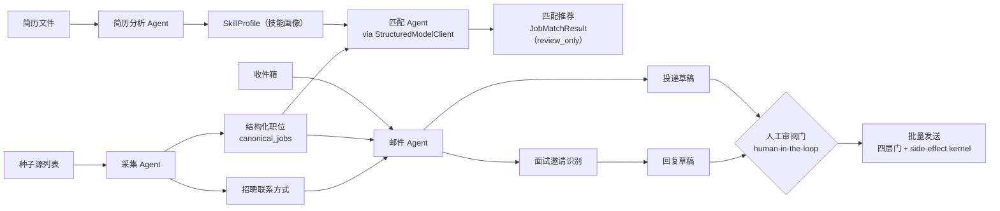

# CareerOps 多 Agent 求职助理系统 — 架构 Spec

- 版本：v0.1（草案）
- 日期：2026-07-23
- 状态：架构部分落地（采集/网关/邮件发送已实现；Agent 编排、定向过滤、业务质量指标待建）
- 关联：[MVP 实施计划](../.omx/plans/careerops-agent-mvp-plan.md)、[ADR 0006 模型隐私](adr/0006-model-privacy.md)

---

## 1. 概述

CareerOps 是一个**安全优先、人工监督**的单用户求职运营助理。本 Spec 描述其
**多 Agent 协作架构**与 **LLM 接入**设计，对应四项核心能力：

1. **多 Agent 协作流程**：将职位采集、简历分析、岗位匹配、邮件沟通拆分为独立 Agent，
   由编排层协调。
2. **浏览器自动化采集**：从招聘网站/社交平台采集职位信息，聚合并结构化处理。
3. **LLM 岗位匹配**：结合用户技能画像，用大模型生成岗位推荐与匹配分析。
4. **邮件 Agent**：识别面试邀请、提取关键信息、辅助生成回复草稿。

**核心定位**：系统是"人工监督的求职助理"，不是"自动海投机器人"。所有外部副作用
（发送邮件等）必须经人工审阅与明确确认。

---

## 2. 系统架构

### 2.1 技术栈

| 层 | 技术 | 职责 | 状态 |
|----|------|------|------|
| Web/API | FastAPI + Jinja2 + HTMX | 服务端渲染控制台、REST API | ✅ 已落地 |
| 工作流编排 | Temporal | 当前唯一在跑的编排引擎；持久化、可恢复的后台工作流 | ✅ 已落地 |
| Agent 编排 | LangGraph | 多 Agent 状态图编排、human-in-the-loop 审核门 | 🎯 目标（未引入，见 §8 / §9） |
| 数据 | PostgreSQL（业务真源）+ Redis（缓存/限流/租约） | 状态持久化 | ✅ 已落地 |
| 数据库迁移 | Alembic | Schema 版本管理 | ✅ 已落地 |
| LLM 网关 | 自研 `StructuredModelClient` | 结构化模型调用、隔离、修复、审计 | ✅ 已落地（见 §4.1） |
| 浏览器自动化 | ego-browser（Chromium） | 渲染 JS 站点、社交平台采集 | 🟡 外部工具（非代码依赖） |
| 可观测性 | Prometheus | 指标 | ✅ 已落地（见 §11.3） |

### 2.2 分层与协作模式

```
┌─────────────────────────────────────────────────────────────┐
│                    LangGraph 编排层（状态图）                   │
│   采集Agent ──→ 简历分析Agent ──→ 匹配Agent ──→ 邮件Agent       │
│        │              │               │             │          │
│        └──────────────┴───── 人工审核门 ─────────────┘          │
└─────────────────────────────────────────────────────────────┘
                            │ 调用
        ┌───────────────────┼───────────────────┐
        ▼                   ▼                   ▼
┌──────────────┐   ┌──────────────────┐   ┌──────────────────┐
│ 自研安全内核    │   │  LLM 网关          │   │  数据采集层        │
│ side-effect   │   │ StructuredModel  │   │ ATS API +        │
│ kernel + 四层门│   │ Client (Xiaomi/  │   │ ego-browser +    │
│ + 审计链       │   │  Zhipu/disabled) │   │ Reddit/X         │
└──────────────┘   └──────────────────┘   └──────────────────┘
```

> **目标架构图**：安全内核 / LLM 网关 / 数据采集层已落地；顶层 **LangGraph 编排层为规划**（未引入依赖，见 §8），落地前 Agent 协作由 `scripts/` 模块 + Temporal 承担。

**设计原则**：LangGraph 只负责 Agent 编排与状态流转；安全强制（副作用授权、四层门、
审计）由自研内核负责；LLM 调用统一走 `StructuredModelClient` 端口。三者解耦。

---

## 3. Agent 设计

每个 Agent 是 LangGraph 状态图中的一个节点（或子图），有明确的输入/输出契约，
通过共享状态（State）传递数据。

### 3.1 职位采集 Agent（Collection Agent）

**职责**：从多源采集职位，聚合、去重、结构化。

**输入**：种子源列表（公司 + ATS board）、爬取策略。
**输出**：结构化职位记录（`canonical_jobs` / `job_postings`）。

**数据源**：
- **ATS 公开 API**：Greenhouse、Lever、Ashby（直接 HTTP JSON）。
- **公司官网**：ego-browser 渲染 JS/SPA 站点，提取 JSON-LD / Sitemap / 静态 HTML。
- **社交平台**：ego-browser 采集 X（Twitter）、Reddit 招聘帖。

**处理**：
- 去重（**当前为确定性 key 去重**）：按 source ID → canonical URL → (company, title) 逐层匹配，命中即合并。语义去重（SimHash/MinHash + 语义候选）**尚未实现**（见 §9）；落地后仅提议候选、不自动合并，合并走人工审核门。
- 版本化：内容变化只新增 version，不覆盖。
- 关闭/重开检测：来源关闭 ≠ canonical job 关闭。

**安全**：SSRF 防护（私网/元数据端点拒绝）、robots 遵守、per-domain 限流、并发上限。

### 3.2 简历分析 Agent（Resume Analysis Agent）

**职责**：解析简历，构建用户技能画像。

**输入**：简历文件（txt/md/pdf）。
**输出**：`SkillProfile`（技能列表、级别、年限、亮点）。

**实现**：
- 确定性技能提取（按语言/前端/后端/数据/云/ML/实践分类）。
- 级别推断（年限 + 关键词）。
- （可选）LLM 增强：用模型补全语义技能、生成摘要。

### 3.3 岗位匹配 Agent（Matching Agent）

**职责**：用 LLM 结合技能画像，对岗位做语义匹配与推荐。

**输入**：`SkillProfile` + 职位记录。
**输出**：`JobMatchResult`（匹配分、tier、命中要求、差距、可迁移技能、
资深度匹配、remote 兼容、推荐理由、推荐等级 apply/consider/skip、置信度）。

**关键设计**：
- JD 作为**不可信外部内容**传入（`untrusted_content` 字段，fenced 为数据），
  JD 中的任何指令对模型无效（防 prompt injection）。
- 只发送脱敏的公开 JD 文本 + 用户自己的技能画像（ADR 0006）。
- 模型输出是 **review_only**：只提议推荐等级，不替用户决定。

### 3.4 邮件沟通 Agent（Email Agent）

**职责**：
1. **面试邀请识别**：从收件箱识别面试邀请类邮件。
2. **信息提取**：提取面试时间、地点、会议链接、联系人。
3. **回复辅助**：生成回复草稿（人工审阅后发送）。
4. **投递邮件生成**：针对岗位生成求职邮件草稿。

**输入**：邮件线程 / 岗位 + 简历。
**输出**：分类标签、结构化信息、回复草稿。

**安全（M6 四层门 + 永久边界）**：
- 发送需经人工审阅 + 明确确认（批量发送前需二次确认）。
- 收件人必须是公开列出或用户手动提供，**绝不猜测/编造**。
- 高风险类别（薪资/offer/visa/身份银行等）**永不自动发送**。
- 发送走 side-effect kernel：Policy → Approval → Outbox → Worker → Receipt → Audit。

---

## 4. LLM 接入

### 4.1 模型网关（`StructuredModelClient`）

统一的模型调用端口，所有 Agent 通过它调用 LLM。**契约定义在代码** `src/careerops/model_gateway/base.py`，本节为摘要：

- `StructuredModelRequest`：`task_type / system_prompt / user_prompt / untrusted_content / schema_name / timeout_seconds / max_tokens / trace_id / metadata`
- `StructuredModelResponse`：`result(dict) / confidence / model_id / is_review_only(恒 True) / repair_attempted / prompt_version / trace_id`
- `StructuredModelClient`（Protocol）：`invoke(request) -> response` + `is_enabled`
- 异常：`ModelProviderDisabled`（disabled 态调用）、`ModelInvocationError`（超时 / HTTP / 网络 / 二次修复仍失败）

**`task_type` 已知值**（自由字符串，建议集中登记）：`job_match`（已用）；`email_classify / email_draft / resume_enhance`（规划）。

**⚠️ `schema_name` 已知缺口（待修）**：当前 `schema_name` 仅作为 prompt 提示传给模型，`_extract_json`（`anthropic_compat.py`）**只验证返回是合法 JSON object，不校验字段是否符合 schema**——结构对、字段错也能通过。Protocol docstring 所称"Validate output against the expected schema"尚未兑现。需在 `invoke` 返回前补真 schema 校验（jsonschema / pydantic）。见 §9。

**强制约束（ADR 0006）**：
- **无工具绑定**：永不发送 `tools` 字段，模型不能调用工具。
- **显式 egress**：单次 urllib 调用到 `{base_url}/v1/messages`，仅资格化 hostname。
- **不记录原始 prompt/response**：只保留结构化输出、哈希、版本、运营元数据。
- **结构化输出 + 一次修复**：输出非法 JSON 时最多重试一次修复，仍失败抛 `ModelInvocationError`。
- **结果始终 review_only**：不能授权策略、选收件人、扩 scope、改状态。

### 4.2 Provider

通过 Anthropic 协议兼容端点接入（`AnthropicCompatClient`）：

| Provider（key） | Base URL | 模型 | 状态 |
|----------|----------|------|------|
| 小米 MiMo（`xiaomi`） | `https://token-plan-cn.xiaomimimo.com/anthropic` | `mimo-v2.5-pro` | 已接入并验证 |
| 智谱 GLM（`zhipu`） | `https://open.bigmodel.cn/api/anthropic` | `glm-5.2` | 可配置 |

> **默认安全态**：`MODEL_PROVIDER=disabled`（`config.py` 默认值）时，`create_model_client` 返回 `DisabledModelAdapter`——不调用任何外部 provider，所有 `invoke` 返回空 review_only 结果。`disabled` 是配置态，不是 provider。

工厂 `create_model_client(provider)` 按 key（`xiaomi` / `zhipu`）创建客户端，从环境变量读取连接配置（`XIAOMI_*` / `ZHIPU_*`：base_url、api_key、model）。

### 4.3 资格化（Qualification）

每个启用的 provider/model 能力必须在 ADR 0006 附录中记录：region、no-training/data-use
条款、保留控制、超时、预算、hostname、通过的封存数据集。provider/model/prompt/redaction/
schema 变更会使该能力的 Release Qualification 失效。

---

## 5. 数据采集与结构化

### 5.1 采集方式

| 源类型 | 方式 | 说明 |
|--------|------|------|
| ATS（Greenhouse/Lever/Ashby） | 直接 HTTP JSON API | 公开 board API |
| 公司官网 | ego-browser 渲染 | JS/SPA 站点，提取 JSON-LD/Sitemap/HTML |
| X / Reddit | ego-browser 采集 | 招聘帖，深度滚动加载 |

### 5.2 结构化输出

- 职位：`data/crawl_*/crawl_*.jsonl`（公司、标题、地点、URL、原始数据、内容哈希）。
- 招聘联系方式：`data/recruiting_contacts.jsonl`（邮箱 + 出处 provenance + 平台 + 上下文）。
- 联系方式提取安全：只提取**明确出现在招聘帖中**的邮箱，过滤噪音（accommodations/feedback/
  support 等非投递邮箱），区分 `[Hiring]`（雇主）vs `[For Hire]`（求职者，排除）。

---

## 6. 数据流

> 下图为**目标 Agent 数据流**（含 LangGraph 编排，尚未落地）。采集、简历分析、
> LLM 网关、邮件发送链路已实现；匹配 Agent、邮件 Agent 的面试邀请识别、Agent 间
> 状态流转为待建/部分。详见第 8 节。



**流向要点**：
- **收件箱**独立流入邮件 Agent 的「面试邀请识别」职责，与采集 Agent 的输出**无数据依赖**。
- **招聘联系方式**是采集 Agent 的副产物（从招聘帖提取邮箱），喂给邮件 Agent 生成投递草稿。
- **投递草稿**与**回复草稿**统一汇入人工审阅门，再经四层门批量发送。
- 匹配 Agent 与邮件 Agent 的 LLM 调用均经 `StructuredModelClient`，输出始终 `review_only`。

---

## 7. 安全边界（永久硬约束）

1. **不无人值守海投，不自动提交申请表**：所有发送经人工审阅 + 明确确认。
2. **不猜测邮箱**：收件人必须公开列出或用户提供。
3. **模型只能 review_only**：不授权策略、不选收件人、不扩 scope、不改状态、不调工具。
4. **邮件发送四层门**：global kill switch + Release Qualification + 账户 opt-in + Policy allowlist。
5. **高风险类别永不自动发送**：薪资/offer/visa/relocation/tax/背景调查/身份银行/withdrawal。
6. **不可信内容隔离**：JD/邮件作为数据 fenced，防 prompt injection。
7. **默认安全态**：`MODEL_PROVIDER=disabled`、外部写关闭、auto-send 关闭。

---

## 8. 实现状态（截至 2026-07-23）

| 模块 | 状态 | 说明 / 证据 |
|------|------|------|
| 职位采集（ATS + 浏览器 + Reddit/X） | ✅ 已实现 | 多源爬取、聚合、结构化；`scripts/crawl_*.py`、`data/crawl_*/` 产物 |
| 采集去重 | 🟡 部分 | 确定性 key 去重（source ID / URL / company+title）已实现；**语义去重未实现**（见 §3.1） |
| 招聘联系方式提取 | ✅ 已实现 | `scripts/extract_contacts.py`，按邮箱去重 + provenance |
| 简历分析（确定性技能提取） | ✅ 已实现 | `scripts/resume_review.py` |
| LLM 网关端口 + disabled 适配器 | ✅ 已实现 | `model_gateway/base.py`（Protocol + dataclass 契约） |
| LLM 接入（Anthropic 兼容） | ✅ 已实现 | `anthropic_compat.py`；小米 MiMo 真实调用验证 |
| schema 强制校验 | ❌ 缺口 | `schema_name` 仅 prompt 提示，`_extract_json` 只验 JSON 合法性、不校验字段（见 §4.1） |
| LLM 岗位匹配 | 🟡 部分 | `application/llm_matching.py` 服务已建；但**爬虫未抓 JD 详情**（当前正文覆盖率待 fixture manifest 固化，历史 `7191` 不作为当前基线），模型仅收到 title/company/location，真实调用报 `model returned no text content`。需先补 detail parser 详情抓取（见 §9） |
| 邮件发送链路（kernel→审阅→批量→回执） | ✅ 已实现 | `side_effect_kernel.py`，测试邮件真实收到 |
| HITL 审核（approval state + expiration） | ✅ 已实现 | side-effect kernel + dashboard `pending_approvals` |
| 邮件 Agent（面试邀请识别 + 信息提取） | ⏳ 待建 | M4 有邮件分类基础，未串成完整流程 |
| 多 Agent 编排（LangGraph） | 🎯 目标 | **未引入依赖**；当前为 scripts 模块，待 LangGraph 状态图 + interrupt 审核 |
| 定向过滤（remote/方向/地区/薪资） | ⏳ 待建 | 当前采集宽泛 |
| 运维可观测性 | ✅ 已实现 | `observability/metrics.py`（operations / http / capability） |
| 业务质量指标（匹配准确率、LLM 成本） | ⏳ 待建 | 见 §11.3 |

---

## 9. 后续规划（按优先级）

1. **补 detail parser 详情抓取**：采集 Agent 当前只做 list（标题/地点/URL），未抓职位详情页 JD 正文（覆盖率待 `tests/fixtures/adapter_manifest.json` 固化，历史 `7191` 不作为当前基线）。这是 LLM 匹配成立的前提——没有 JD，语义匹配名不副实。用受 SSRF/allowlist 约束的 HTTP fetcher 抓详情页并回填 `raw_data.description`。
2. **补 schema 强制校验**：`StructuredModelClient` 返回前用 jsonschema / pydantic 校验 `result`，堵 §4.1 缺口。
3. **LangGraph 多 Agent 编排**：引入依赖，定义 `CareerOpsState`（草案见 §9.1），串采集/简历/匹配/邮件，`interrupt_before` 接审核门。
4. **邮件 Agent 完整化**：面试邀请识别 + 时间/地点/链接提取 + 回复草稿。
5. **定向过滤**：按 remote/方向/地区/薪资筛选采集结果与联系方式。
6. **语义去重**：SimHash/MinHash + 语义候选（仅提议，人工合并）。
7. **错误处理矩阵补全**：见 §11.2，补 LLM rate-limit 退避、爬虫 circuit breaker、outbox 重试上限。
8. **业务质量指标**：匹配准确率（apply→interview 转化）、LLM token 聚合计数（受 ADR 0006 约束，不记内容）。
9. **LLM 资格化**：补 ADR 0006 附录，记录小米 MiMo 隐私资格。

### 9.1 目标 State 草案（LangGraph 落地时细化）

```python
class CareerOpsState(TypedDict):
    skill_profile: SkillProfile | None
    jobs: list[CanonicalJob]
    matches: list[JobMatchResult]
    contacts: list[RecruitingContact]
    email_threads: list[EmailThread]
    drafts: list[EmailDraft]             # 投递草稿 + 回复草稿
    pending_review: list[ReviewRequest]  # interrupt 待审项
```

---

## 10. 与 MVP 计划的关系

本 Spec 聚焦 **AI Agent 系统架构**（多 Agent + LLM），是 MVP 计划中 M2（匹配）、
M4（邮件）、M6（发送）能力的架构细化。MVP 计划的安全边界、数据模型、里程碑 gate
仍然有效；本 Spec 在其框架内描述 Agent 化与 LLM 接入的具体设计。

---

## 11. 运行时机制

### 11.1 人工审核（HITL）

所有外部副作用经 side-effect kernel：`Policy → Approval → Outbox → Worker → Receipt → Audit`（`application/side_effect_kernel.py`）。

- **触发**：Web 控制台（dashboard `pending_approvals` / `pending_outbox_events`），非邮件 / webhook。
- **粒度**：逐条 approval；批量发送前二次确认。
- **过期**：approval 绑定 expiration，超期自动失效需重审。
- **LangGraph 落地后**：`interrupt_before` 在审核节点挂起，待审项入 `State.pending_review`。

### 11.2 错误处理与降级

| 组件 | 失败模式 | 当前策略 | 待补 |
|---|---|---|---|
| LLM 网关 | 超时 / HTTP / 网络 | 揉成 `ModelInvocationError`；调用方 try/except 降级为 advisory `error` | 429 rate-limit 退避 |
| LLM 网关 | disabled | `DisabledModelAdapter` 返回空 review_only | — |
| 匹配 | 模型不可用 | 返回 `JobMatchResult(error=...)`，不阻塞批次 | 可选 fallback 到确定性匹配 |
| 采集 | 被限流 / ban | Temporal `RetryPolicy` 重试 | per-domain circuit breaker |
| 邮件发送 | provider 失败 | outbox 重试 + 审计 | 重试上限 + 死信队列 |

### 11.3 可观测性（Prometheus）

**已实现**（`observability/metrics.py`）：

- `careerops_operations_total{component,outcome}` — component: crawl/matching/email/calendar/storage/outbox；outcome: success/failure/denied/retry
- `careerops_http_requests_total` / `careerops_http_request_duration_seconds`
- `careerops_capability_enabled` — model_provider / google_oauth / external_writes / auto_send

**待建（业务质量）**：匹配准确率（apply→interview 转化）、LLM token 聚合计数（受 ADR 0006 约束，**只记聚合不记内容**）。
